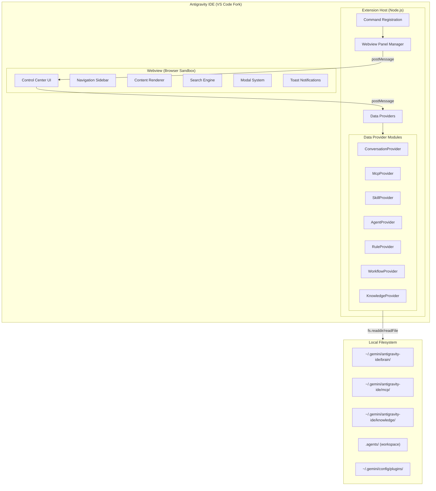

# Antigravity Control Center — Implementation Plan

> **Version:** 2.1.0  
> **Date:** 2026-06-16  
> **Status:** Approved — ConnectRPC Integration & Cross-Workspace Support  
> **PRD Reference:** [acc.PRD.md](file:///Users/firo/tenn/firothehero/antigravity-control-center/documentation/acc.PRD.md)

---

## Table of Contents

1. [Architecture Overview](#1-architecture-overview)
2. [Project Structure](#2-project-structure)
3. [Phase 1 — Foundation (MVP)](#3-phase-1--foundation-mvp)
4. [Phase 2 — Skills & Agents](#4-phase-2--skills--agents)
5. [Phase 3 — Power Features](#5-phase-3--power-features)
6. [Testing Strategy](#6-testing-strategy)
7. [Build & Distribution](#7-build--distribution)
8. [Risk Register](#8-risk-register)
9. [Progress Tracker](#9-progress-tracker)

---

## 1. Architecture Overview

### 1.1 High-Level Architecture

The extension follows a **three-layer** architecture:



### 1.2 Data Flow

```
User clicks "Control Center" button
  → VS Code command fires
  → Extension creates/reveals WebviewPanel
  → Webview sends `request:*` message
  → Extension host reads filesystem
  → Extension sends `data:*` message back
  → Webview renders data in UI
```

### 1.3 Technology Decisions

| Decision | Choice | Rationale |
|---|---|---|
| **Extension Language** | TypeScript 5.x | VS Code extensions are first-class TypeScript; type safety for complex data models; antigravity-sdk compatibility |
| **Webview UI** | Vanilla HTML/CSS/JS (no React/Vue) | Webviews are sandboxed iframes — framework overhead is unnecessary for a dashboard; faster load; simpler CSP; full CSS control |
| **Build Tool** | esbuild | 100x faster than webpack; native VS Code extension template support; tree-shaking |
| **Markdown Rendering** | marked (in webview) | Lightweight, battle-tested Markdown→HTML converter; needed for skill/rule/KI rendering |
| **JSONL Parsing** | Custom streaming parser | `transcript.jsonl` files can be large; line-by-line parsing avoids loading entire files into memory |
| **YAML Frontmatter** | gray-matter | Standard library for extracting YAML frontmatter from Markdown files (SKILL.md metadata) |

---

## 2. Project Structure

```
antigravity-control-center/
├── .vscode/
│   ├── launch.json              # Extension debug configuration
│   └── tasks.json               # Build tasks
├── documentation/
│   ├── cc.PRD.md                # Product Requirements Document
│   └── cc_implementation_plan.md # This file
├── src/
│   ├── extension.ts             # Entry point: activate(), deactivate()
│   ├── commands/
│   │   └── openControlCenter.ts # Command handler for opening CC
│   ├── providers/
│   │   ├── conversationProvider.ts
│   │   ├── mcpProvider.ts
│   │   ├── skillProvider.ts
│   │   ├── agentProvider.ts
│   │   ├── ruleProvider.ts
│   │   ├── workflowProvider.ts
│   │   └── knowledgeProvider.ts
│   ├── webview/
│   │   ├── webviewManager.ts    # Creates/manages Webview panel
│   │   └── getWebviewContent.ts # Generates HTML for webview
│   ├── models/
│   │   ├── conversation.ts      # TypeScript interfaces
│   │   ├── mcpServer.ts
│   │   ├── skill.ts
│   │   ├── agent.ts
│   │   ├── rule.ts
│   │   ├── workflow.ts
│   │   └── knowledgeItem.ts
│   └── utils/
│       ├── paths.ts             # Data directory path resolution
│       ├── fileSystem.ts        # Safe filesystem read helpers
│       ├── jsonlParser.ts       # Streaming JSONL parser
│       └── markdownParser.ts    # Frontmatter + content extraction
├── media/
│   ├── webview/
│   │   ├── index.css            # Main webview stylesheet (design system)
│   │   ├── app.js               # Main webview JavaScript
│   │   ├── modules/
│   │   │   ├── conversations.js # Conversation UI module
│   │   │   ├── mcpServers.js    # MCP Servers UI module
│   │   │   ├── skills.js        # Skills UI module
│   │   │   ├── agents.js        # Agents UI module
│   │   │   ├── rules.js         # Rules UI module
│   │   │   ├── workflows.js     # Workflows UI module
│   │   │   ├── knowledge.js     # Knowledge Items UI module
│   │   │   └── settings.js      # Settings UI module
│   │   └── components/
│   │       ├── sidebar.js       # Navigation sidebar component
│   │       ├── searchBar.js     # Reusable search bar
│   │       ├── modal.js         # Modal dialog system
│   │       ├── toast.js         # Toast notification system
│   │       ├── card.js          # Reusable card component
│   │       ├── table.js         # Sortable data table
│   │       ├── skeleton.js      # Loading skeleton component
│   │       └── codeBlock.js     # Syntax-highlighted code block
│   └── icons/
│       └── control-center.svg   # Custom extension icon
├── testing/
│   ├── test_conversations.py    # Test conversation provider
│   ├── test_mcp_provider.py     # Test MCP provider
│   └── test_extension.py        # Integration tests
├── package.json                 # Extension manifest
├── tsconfig.json                # TypeScript configuration
├── esbuild.config.mjs           # esbuild bundler config
├── .eslintrc.json               # ESLint config
├── .vscodeignore                # Files to exclude from VSIX
├── CHANGELOG.md                 # Version changelog
├── LICENSE                      # License file
├── README.md                    # Extension README (for marketplace)
└── requirements.txt             # Python test dependencies
```

---

## 3. Phase 1 — Foundation (MVP)

**Goal:** Ship a working extension with the "Control Center" button, a beautiful dark-mode webview shell, and the two highest-value modules: Conversations and MCP Servers.

**Estimated Effort:** 5-7 days

---

### Task 1.1 — Project Scaffolding

**Depends on:** Nothing (starting point)  
**Files to create:** `package.json`, `tsconfig.json`, `esbuild.config.mjs`, `.vscode/launch.json`, `.vscode/tasks.json`, `.eslintrc.json`, `.vscodeignore`, `CHANGELOG.md`

#### Checklist

- [ ] **1.1.1** Initialize npm project in `antigravity-control-center/` via `npm init -y`
- [ ] **1.1.2** Install dev dependencies: `@types/vscode`, `typescript`, `esbuild`, `@types/node`, `eslint`
- [ ] **1.1.3** Install runtime dependency: `gray-matter`
- [ ] **1.1.4** Create `package.json` extension manifest with:
  - [ ] Extension metadata (`name`, `displayName`, `description`, `version: 0.1.0`, `publisher: tenn-ai`)
  - [ ] Engine requirement: `"vscode": "^1.85.0"`
  - [ ] Activation event: `"*"` (activate on IDE startup)
  - [ ] Main entry: `"./dist/extension.js"`
  - [ ] Command contribution: `controlCenter.open` with title "Control Center" and icon `$(dashboard)`
  - [ ] Menu contribution: `editor/title` → `controlCenter.open` in `navigation` group
  - [ ] Configuration contribution: `controlCenter.openMode` (webview|external), `controlCenter.defaultTab`, `controlCenter.dataDirectory`
  - [ ] NPM scripts: `"build"`, `"watch"`, `"lint"`, `"package"`
- [ ] **1.1.5** Create `tsconfig.json` with:
  - [ ] Target: `ES2022`, Module: `commonjs`
  - [ ] Strict mode enabled
  - [ ] `outDir: dist`, `rootDir: src`
  - [ ] Source maps enabled
  - [ ] `resolveJsonModule: true`, `skipLibCheck: true`
  - [ ] Exclude: `node_modules`, `dist`, `media`
- [ ] **1.1.6** Create `esbuild.config.mjs` with:
  - [ ] Entry point: `src/extension.ts`
  - [ ] Output: `dist/extension.js`
  - [ ] Bundle mode with `vscode` as external
  - [ ] Platform: `node`, target: `node18`
  - [ ] Watch mode support via `--watch` flag
  - [ ] Minification in production, source maps always
- [ ] **1.1.7** Create `.vscode/launch.json` with Extension Development Host configuration:
  - [ ] `extensionDevelopmentPath` pointed to workspace folder
  - [ ] `outFiles` pointed to `dist/**/*.js`
  - [ ] `preLaunchTask: build`
- [ ] **1.1.8** Create `.vscode/tasks.json` with build and watch tasks:
  - [ ] `build` task runs `npm run build`
  - [ ] `watch` task runs `npm run watch` in background
- [ ] **1.1.9** Create `.eslintrc.json` with TypeScript-aware ESLint config
- [ ] **1.1.10** Create `.vscodeignore` excluding `src/`, `testing/`, `documentation/`, `node_modules/`, `*.ts`, config files
- [ ] **1.1.11** Create initial `CHANGELOG.md` with v0.1.0 section

#### Verification
- [ ] `npm install` completes without errors
- [ ] `npm run build` compiles successfully and produces `dist/extension.js`
- [ ] `npm run watch` starts esbuild in watch mode
- [ ] Extension loads in Extension Development Host (F5) without activation errors

---

### Task 1.2 — Extension Entry Point & Command Registration

**Depends on:** Task 1.1  
**Files to create:** `src/extension.ts`, `src/commands/openControlCenter.ts`

#### Checklist

- [ ] **1.2.1** Create `src/extension.ts`:
  - [ ] Import `vscode` and `openControlCenter` command handler
  - [ ] Implement `activate(context)` function that:
    - [ ] Logs activation message to console
    - [ ] Registers `controlCenter.open` command via `vscode.commands.registerCommand`
    - [ ] Pushes disposable to `context.subscriptions`
  - [ ] Implement empty `deactivate()` function
- [ ] **1.2.2** Create `src/commands/openControlCenter.ts`:
  - [ ] Maintain singleton `webviewManager` reference at module level
  - [ ] Implement `openControlCenter(context)` function that:
    - [ ] If `webviewManager` exists → call `reveal()` (bring to front, no duplicate)
    - [ ] If not → create new `WebviewManager(context)`
    - [ ] Subscribe to `onDidDispose` to clear the singleton reference
- [ ] **1.2.3** Verify command is wired correctly in `package.json` contributes section

#### Verification
- [ ] "Control Center" button appears in the top-right toolbar of the editor
- [ ] Clicking the button opens a new webview panel tab
- [ ] Clicking the button a second time reveals the existing panel (does not create a duplicate)
- [ ] Closing the panel and clicking the button again creates a fresh panel
- [ ] No error in the Extension Development Host console

---

### Task 1.3 — Utility Modules

**Depends on:** Task 1.1  
**Files to create:** `src/utils/paths.ts`, `src/utils/fileSystem.ts`, `src/utils/jsonlParser.ts`, `src/utils/markdownParser.ts`

#### 1.3.A — Path Resolution (`paths.ts`)

- [ ] **1.3.1** Implement `getDataDirectory()`:
  - [ ] Read custom path from `controlCenter.dataDirectory` setting
  - [ ] Fall back to platform-default `~/.gemini/antigravity-ide`
  - [ ] Use `os.homedir()` for cross-platform home directory
- [ ] **1.3.2** Implement `getBrainDirectory()` → `{dataDir}/brain/`
- [ ] **1.3.3** Implement `getMcpDirectory()` → `{dataDir}/mcp/`
- [ ] **1.3.4** Implement `getKnowledgeDirectory()` → `{dataDir}/knowledge/`
- [ ] **1.3.5** Implement `getWorkspaceAgentsDirectory()`:
  - [ ] Read first workspace folder from `vscode.workspace.workspaceFolders`
  - [ ] Return `{workspaceRoot}/.agents/` or `undefined` if no workspace
- [ ] **1.3.6** Implement `getGlobalPluginsDirectory()` → `~/.gemini/config/plugins/`
- [ ] **1.3.7** Use `path.join()` for all path construction (cross-platform safety)

#### 1.3.B — Filesystem Helpers (`fileSystem.ts`)

- [ ] **1.3.8** Implement `safeReadDir(dirPath)`:
  - [ ] Wraps `fs.readdir()` in try/catch
  - [ ] Returns empty array on any error (dir doesn't exist, permission denied)
- [ ] **1.3.9** Implement `safeReadFile(filePath)`:
  - [ ] Wraps `fs.readFile(path, 'utf-8')` in try/catch
  - [ ] Returns `null` on any error
- [ ] **1.3.10** Implement `safeReadJson<T>(filePath)`:
  - [ ] Calls `safeReadFile` then `JSON.parse`
  - [ ] Returns typed result or `null` on parse error
- [ ] **1.3.11** Implement `directoryExists(dirPath)`:
  - [ ] Uses `fs.stat()` and checks `isDirectory()`
  - [ ] Returns `false` on error
- [ ] **1.3.12** Implement `getSubDirectories(dirPath)`:
  - [ ] Lists entries, filters hidden (`.` prefix), checks `isDirectory`
  - [ ] Returns array of subdirectory names
- [ ] **1.3.13** Implement `getFileStat(filePath)`:
  - [ ] Returns `{ createdAt, modifiedAt, size }` or null
  - [ ] Used for conversation timestamps

#### 1.3.C — JSONL Parser (`jsonlParser.ts`)

- [ ] **1.3.14** Define `TranscriptStep` interface:
  - [ ] Fields: `step_index`, `source`, `type`, `status`, `content?`, `tool_calls?`
- [ ] **1.3.15** Implement `parseJsonl(content: string): TranscriptStep[]`:
  - [ ] Split content by newline, filter empty lines
  - [ ] Parse each line as JSON, skip malformed lines silently
  - [ ] Return array of typed `TranscriptStep` objects
- [ ] **1.3.16** Implement `parseJsonlPaginated(content, page, pageSize)`:
  - [ ] Parse only the requested page of lines (for large transcripts)
  - [ ] Return `{ steps, totalCount, totalPages, currentPage }`

#### 1.3.D — Markdown Parser (`markdownParser.ts`)

- [ ] **1.3.17** Define `ParsedMarkdown` interface: `{ metadata: Record<string, any>, content: string }`
- [ ] **1.3.18** Implement `parseMarkdown(raw)` using `gray-matter`:
  - [ ] Extract YAML frontmatter into `metadata`
  - [ ] Return trimmed content body
- [ ] **1.3.19** Implement `extractTitle(raw)`:
  - [ ] First try: `metadata.name` from frontmatter
  - [ ] Second try: first `# Heading` in content
  - [ ] Fallback: first 80 characters of content

#### Verification
- [ ] All path functions return correct absolute paths on macOS
- [ ] `safeReadDir` and `safeReadFile` return empty/null for non-existent paths (no throws)
- [ ] `parseJsonl` correctly parses a sample `transcript.jsonl` file
- [ ] `parseMarkdown` correctly extracts frontmatter from a `SKILL.md` file
- [ ] TypeScript compiles all utility files without errors

---

### Task 1.4 — Data Models (TypeScript Interfaces)

**Depends on:** Task 1.1  
**Files to create:** `src/models/conversation.ts`, `src/models/mcpServer.ts`, `src/models/skill.ts`, `src/models/agent.ts`, `src/models/rule.ts`, `src/models/workflow.ts`, `src/models/knowledgeItem.ts`, `src/models/index.ts`

#### Checklist

- [ ] **1.4.1** Create `conversation.ts`:
  - [ ] `Conversation` interface: `id`, `title`, `summary?`, `createdAt?`, `lastModified?`, `stepCount`, `artifactPath`, `hasTranscript`
  - [ ] `ConversationDetail` extends `Conversation` with: `steps: TranscriptStep[]`, `artifacts: string[]`, `userMessages: number`, `agentMessages: number`, `toolCalls: number`
- [ ] **1.4.2** Create `mcpServer.ts`:
  - [ ] `McpTool` interface: `name`, `description`, `parameters: Record<string, any>`, `isEager: boolean`
  - [ ] `McpServer` interface: `name`, `toolCount`, `eagerTools: McpTool[]`, `lazyTools: McpTool[]`, `hasInstructions`, `instructions?`
- [ ] **1.4.3** Create `skill.ts`:
  - [ ] `Skill` interface: `name`, `description`, `source: 'workspace' | 'global' | 'plugin'`, `sourcePath`, `pluginName?`, `content`, `hasScripts`, `hasExamples`, `hasReferences`
- [ ] **1.4.4** Create `agent.ts`:
  - [ ] `Agent` interface: `name`, `description?`, `model?`, `skills: string[]`, `tools: string[]`, `sourcePath`, `content`
- [ ] **1.4.5** Create `rule.ts`:
  - [ ] `Rule` interface: `name`, `filename`, `content`, `sourcePath`, `preview: string` (first 200 chars), `scope: 'workspace' | 'global'`
- [ ] **1.4.6** Create `workflow.ts`:
  - [ ] `Workflow` interface: `name`, `slashCommand`, `filename`, `description`, `content`, `sourcePath`
- [ ] **1.4.7** Create `knowledgeItem.ts`:
  - [ ] `KnowledgeItem` interface: `id`, `title`, `summary`, `lastAccessed?`, `references: string[]`, `artifactPaths: string[]`, `basePath`
  - [ ] `KnowledgeArtifact` interface: `relativePath`, `absolutePath`, `content?`
- [ ] **1.4.8** Create `index.ts` barrel file re-exporting all model interfaces
- [ ] **1.4.9** Create `messages.ts` with message type unions:
  - [ ] `WebviewToExtensionMessage` union type for all `request:*` and `action:*` messages
  - [ ] `ExtensionToWebviewMessage` union type for all `data:*` and `error:*` messages

#### Verification
- [ ] TypeScript compiles all model files without errors
- [ ] All interfaces are importable via `'../models'` barrel import
- [ ] Message types cover all planned extension ↔ webview communication

---

### Task 1.5 — Data Providers (Conversations & MCP)

**Depends on:** Tasks 1.3, 1.4  
**Files to create:** `src/providers/conversationProvider.ts`, `src/providers/mcpProvider.ts`

#### 1.5.A — Conversation Provider

- [ ] **1.5.1** Implement `getConversations(): Promise<Conversation[]>`:
  - [ ] Read `brain/` directory via `getSubDirectories()`
  - [ ] For each conversation directory:
    - [ ] Check for `transcript.jsonl` at `.system_generated/logs/transcript.jsonl`
    - [ ] Extract title from first `USER_INPUT` step in transcript
    - [ ] Count total lines as `stepCount`
    - [ ] Get filesystem stats for `createdAt` and `lastModified` timestamps
    - [ ] Set `hasTranscript` boolean
  - [ ] Sort by `lastModified` descending (most recent first)
  - [ ] Return typed `Conversation[]`
- [ ] **1.5.2** Implement `getConversationDetail(id): Promise<ConversationDetail | null>`:
  - [ ] Read full `transcript.jsonl` content
  - [ ] Parse via `parseJsonl()` into `TranscriptStep[]`
  - [ ] Count `userMessages`, `agentMessages`, `toolCalls` from step types
  - [ ] List artifact files from the conversation directory
  - [ ] Return `ConversationDetail` or `null` if not found
- [ ] **1.5.3** Implement `getConversationTranscriptPage(id, page, pageSize)`:
  - [ ] Paginated loading for large transcripts (default 50 steps/page)
  - [ ] Return `{ steps, totalCount, totalPages, currentPage }`
- [ ] **1.5.4** Implement `searchConversations(query): Promise<Conversation[]>`:
  - [ ] Case-insensitive substring match on conversation `title`
  - [ ] Return filtered list maintaining sort order

#### 1.5.B — MCP Provider

- [ ] **1.5.5** Implement `getMcpServers(): Promise<McpServer[]>`:
  - [ ] Read `mcp/` directory via `getSubDirectories()`
  - [ ] For each server directory:
    - [ ] List all `.json` files (tool schemas)
    - [ ] Check for `instructions.md` file
    - [ ] For each tool JSON file:
      - [ ] Read and parse JSON schema
      - [ ] Extract `name`, `description`, `parameters`
      - [ ] Classify as eager vs lazy (default: lazy)
      - [ ] Create `McpTool` object
    - [ ] Read `instructions.md` if present
    - [ ] Create `McpServer` object with tool counts
  - [ ] Sort servers alphabetically by name
  - [ ] Return typed `McpServer[]`
- [ ] **1.5.6** Implement `getMcpToolDetail(serverName, toolName): Promise<McpTool | null>`:
  - [ ] Read specific tool JSON schema file
  - [ ] Return full tool object with complete parameter definitions
- [ ] **1.5.7** Implement `searchMcpTools(query): Promise<{server: string, tool: McpTool}[]>`:
  - [ ] Search across all servers' tool names and descriptions
  - [ ] Return matched tools with their server names

#### Verification
- [ ] `getConversations()` returns correct data from real `~/.gemini/antigravity-ide/brain/` directory
- [ ] Conversation titles are extracted correctly (first user message, not UUID)
- [ ] `getConversationDetail()` parses transcript.jsonl correctly
- [ ] Pagination returns correct page boundaries
- [ ] `getMcpServers()` returns correct data from real `~/.gemini/antigravity-ide/mcp/` directory
- [ ] Tool schemas parse correctly with all parameters visible
- [ ] Search functions filter results correctly
- [ ] All functions handle missing/corrupted data gracefully (no throws)

---

### Task 1.6 — Webview Manager & HTML Generation

**Depends on:** Tasks 1.2, 1.5  
**Files to create:** `src/webview/webviewManager.ts`, `src/webview/getWebviewContent.ts`

#### 1.6.A — Webview Manager

- [ ] **1.6.1** Create `WebviewManager` class with:
  - [ ] Private `panel: WebviewPanel` member
  - [ ] Private `disposables: Disposable[]` array for cleanup
  - [ ] Public `onDidDispose` event emitter
- [ ] **1.6.2** Implement constructor:
  - [ ] Create `WebviewPanel` via `vscode.window.createWebviewPanel()`:
    - [ ] ViewType: `'controlCenter'`
    - [ ] Title: `'⚡ Antigravity Control Center'`
    - [ ] Column: `vscode.ViewColumn.One`
    - [ ] Options: `enableScripts: true`, `retainContextWhenHidden: true`
    - [ ] `localResourceRoots` set to `media/` directory
  - [ ] Set panel HTML via `getWebviewContent()`
  - [ ] Register `onDidReceiveMessage` handler
  - [ ] Register `onDidDispose` cleanup handler
- [ ] **1.6.3** Implement `reveal()` method:
  - [ ] Calls `panel.reveal(ViewColumn.One)` to bring panel to front
- [ ] **1.6.4** Implement `handleMessage(message)` dispatcher:
  - [ ] `request:conversations` → call `getConversations()` → post `data:conversations`
  - [ ] `request:conversationDetail` → call `getConversationDetail(id)` → post `data:conversationDetail`
  - [ ] `request:conversationPage` → call paginated loader → post `data:conversationPage`
  - [ ] `request:mcpServers` → call `getMcpServers()` → post `data:mcpServers`
  - [ ] `request:mcpToolDetail` → call `getMcpToolDetail()` → post `data:mcpToolDetail`
  - [ ] `request:refresh` → reload all data sources
  - [ ] Error wrapping: catch errors and post `error:*` messages with human-readable text
- [ ] **1.6.5** Implement `dispose()`:
  - [ ] Dispose all subscriptions in `disposables`
  - [ ] Fire `onDidDispose` event
  - [ ] Cleanup event emitter

#### 1.6.B — HTML Content Generator

- [ ] **1.6.6** Implement `getWebviewContent(webview, extensionUri)`:
  - [ ] Generate unique nonce for CSP
  - [ ] Build Content Security Policy string:
    - [ ] `default-src 'none'`
    - [ ] `style-src ${webview.cspSource} 'unsafe-inline' https://fonts.googleapis.com`
    - [ ] `font-src https://fonts.gstatic.com`
    - [ ] `script-src 'nonce-${nonce}'`
    - [ ] `img-src ${webview.cspSource} data:`
  - [ ] Resolve `media/webview/index.css` URI via `webview.asWebviewUri()`
  - [ ] Resolve `media/webview/app.js` URI via `webview.asWebviewUri()`
  - [ ] Resolve all component and module JS URIs
  - [ ] Generate full HTML document with:
    - [ ] `<!DOCTYPE html>` and `<html lang="en">` wrapper
    - [ ] `<meta charset="UTF-8">` and viewport meta
    - [ ] CSP `<meta>` tag
    - [ ] Google Fonts `<link>` for Inter (400, 500, 600, 700)
    - [ ] `<link>` to `index.css`
    - [ ] Body containing the app shell HTML structure (sidebar + content area + status bar)
    - [ ] `<script nonce>` tag acquiring VS Code API
    - [ ] `<script nonce>` tags for component and module JS files (in correct load order)

#### Verification
- [ ] Webview panel opens with styled HTML content (not blank)
- [ ] CSP does not block any resources (check webview DevTools console)
- [ ] Google Fonts (Inter) loads correctly in the webview
- [ ] CSS stylesheet applies correctly (dark background, styled elements)
- [ ] JavaScript initializes and VS Code API is acquired
- [ ] Messages flow correctly: webview → extension → webview (round-trip test)
- [ ] `retainContextWhenHidden` preserves state when panel is hidden/shown

---

### Task 1.7 — Webview UI: Design System & Shell

**Depends on:** Task 1.6  
**Files to create:** `media/webview/index.css`, `media/webview/app.js`, `media/webview/components/sidebar.js`, `media/webview/components/searchBar.js`, `media/webview/components/modal.js`, `media/webview/components/toast.js`, `media/webview/components/card.js`, `media/webview/components/table.js`, `media/webview/components/skeleton.js`, `media/webview/components/codeBlock.js`

#### 1.7.A — Design System CSS (`index.css`)

- [ ] **1.7.1** Define CSS custom properties (design tokens):
  - [ ] Color palette: background gradient, surface, accent (violet/teal), semantic colors (success/warning/error), text colors
  - [ ] Spacing scale: `--space-1` through `--space-12` (4px increments)
  - [ ] Typography: `--font-family: 'Inter', system-ui, sans-serif`, size scale (xs through 2xl), weight scale
  - [ ] Border radii: `--radius-sm: 6px`, `--radius-md: 8px`, `--radius-lg: 12px`, `--radius-xl: 16px`
  - [ ] Shadows: `--shadow-sm`, `--shadow-md`, `--shadow-lg`, `--shadow-glow` (accent color glow)
  - [ ] Transitions: `--transition-fast: 150ms`, `--transition-normal: 250ms`, `--transition-slow: 400ms`
  - [ ] Z-index scale: `--z-dropdown: 100`, `--z-modal: 200`, `--z-toast: 300`
- [ ] **1.7.2** Define base/reset styles:
  - [ ] Box-sizing `border-box` globally
  - [ ] Body: dark background gradient, zero margin, font-family from tokens
  - [ ] Scrollbar styling: thin width, custom thumb/track colors, rounded thumb
  - [ ] `::selection` with accent color
- [ ] **1.7.3** Define layout grid:
  - [ ] `.app-shell`: CSS Grid with sidebar column (240px) + content column (1fr) + full height (100vh)
  - [ ] `.sidebar`: fixed left panel, dark surface, vertical nav list, border-right
  - [ ] `.content-area`: scrollable main area with padding
  - [ ] `.top-bar`: module title + search + action buttons, sticky top, glassmorphism backdrop
  - [ ] `.status-bar`: fixed bottom, subtle background, small text
- [ ] **1.7.4** Define sidebar component styles:
  - [ ] Nav items: icon + label, padding, hover highlight, active accent border-left
  - [ ] Collapse toggle button (hamburger → chevron)
  - [ ] Collapsed state: icons only, narrow width (60px)
  - [ ] Smooth width transition on collapse/expand
- [ ] **1.7.5** Define card component styles:
  - [ ] `.card`: surface background, rounded corners, subtle border, padding
  - [ ] `.card:hover`: slight scale transform (1.01), shadow increase, border accent glow
  - [ ] `.card-header`, `.card-body`, `.card-footer` sections
  - [ ] `.card-badge`: small rounded pill for counts/status
- [ ] **1.7.6** Define table component styles:
  - [ ] `.data-table`: full width, collapsed borders
  - [ ] `.data-table th`: slightly darker background, left-aligned, sortable cursor
  - [ ] `.data-table td`: padding, bottom border
  - [ ] `.data-table tr:hover`: row highlight
- [ ] **1.7.7** Define search bar styles:
  - [ ] `.search-bar`: rounded input with magnifying glass icon, clear button
  - [ ] Focus state: accent border glow
  - [ ] Results count indicator
- [ ] **1.7.8** Define modal styles:
  - [ ] `.modal-overlay`: full viewport, dark semi-transparent backdrop, `backdrop-filter: blur(4px)`
  - [ ] `.modal`: centered panel, surface background, rounded corners, max-width 600px
  - [ ] `.modal-header`: title + close button
  - [ ] `.modal-body`: scrollable content area
  - [ ] `.modal-footer`: action buttons (primary/secondary/danger)
  - [ ] Fade-in animation on open, fade-out on close
- [ ] **1.7.9** Define toast styles:
  - [ ] `.toast-container`: fixed bottom-right, stacking column
  - [ ] `.toast`: rounded panel, icon + message + close, slide-in from right
  - [ ] Variants: success (green), error (red), warning (amber), info (blue)
  - [ ] Auto-dismiss progress bar animation
- [ ] **1.7.10** Define skeleton loading styles:
  - [ ] `.skeleton`: rounded rectangle with shimmer gradient animation
  - [ ] `.skeleton-text`: multiple lines of varying width
  - [ ] `.skeleton-card`: card-shaped skeleton placeholder
- [ ] **1.7.11** Define code block styles:
  - [ ] `.code-block`: monospace font, dark background, rounded, padding
  - [ ] Line numbers column
  - [ ] Copy button (top-right corner)
  - [ ] Horizontal scroll for long lines
- [ ] **1.7.12** Define utility classes:
  - [ ] `.text-primary`, `.text-secondary`, `.text-accent`
  - [ ] `.badge`, `.badge-success`, `.badge-warning`, `.badge-error`
  - [ ] `.btn`, `.btn-primary`, `.btn-secondary`, `.btn-danger`, `.btn-icon`
  - [ ] `.flex`, `.flex-col`, `.gap-*`, `.justify-between`, `.items-center`
  - [ ] `.hidden`, `.fade-in`, `.slide-in-right`
- [ ] **1.7.13** Define responsive breakpoints:
  - [ ] Below 800px: sidebar auto-collapses to icon mode
  - [ ] Below 600px: sidebar hidden behind toggle button

#### 1.7.B — Main Application Controller (`app.js`)

- [ ] **1.7.14** Acquire VS Code API via `acquireVsCodeApi()` and store reference
- [ ] **1.7.15** Implement state management:
  - [ ] `currentModule` (active nav item): default from settings or `'conversations'`
  - [ ] `moduleData` cache object: stores last-loaded data per module
  - [ ] `searchQuery` per module
  - [ ] Persist state via `vscode.setState()` / restore via `vscode.getState()`
- [ ] **1.7.16** Implement message listener (`window.addEventListener('message')`):
  - [ ] Route `data:*` messages to appropriate module renderer
  - [ ] Handle `error:*` messages with toast notifications
  - [ ] Cache received data in `moduleData`
- [ ] **1.7.17** Implement navigation handler:
  - [ ] Click sidebar item → update `currentModule` → fade transition → request data if not cached → render module
  - [ ] Update active state in sidebar
  - [ ] Update top bar title and search placeholder
- [ ] **1.7.18** Implement debounced search:
  - [ ] Debounce input by 300ms
  - [ ] Pass query to active module's filter function
  - [ ] Clear button resets filter
- [ ] **1.7.19** Implement module renderer dispatch:
  - [ ] Map `currentModule` string to module render function
  - [ ] Call module's `render(container, data)` function
  - [ ] Show skeleton loader while data is loading
- [ ] **1.7.20** Implement global keyboard shortcuts:
  - [ ] `Escape` → close any open modal
  - [ ] `Ctrl/Cmd + K` → focus search bar
  - [ ] `Ctrl/Cmd + R` → refresh current module data

#### 1.7.C — Component JS Files

- [ ] **1.7.21** `sidebar.js`:
  - [ ] Render nav items from config array: `[{ id, icon, label }]`
  - [ ] Handle click events to trigger navigation
  - [ ] Manage active state (highlight current item)
  - [ ] Implement collapse/expand toggle with smooth animation
  - [ ] Show item count badges (loaded from module data)
- [ ] **1.7.22** `searchBar.js`:
  - [ ] Render input with magnifying glass icon prefix
  - [ ] Debounced `oninput` handler (300ms)
  - [ ] Clear button (×) appears when input has text
  - [ ] Results count display (`"12 results"`)
  - [ ] Expose `onSearch(callback)` event
- [ ] **1.7.23** `modal.js`:
  - [ ] `showModal({ title, body, actions })` function
  - [ ] `hideModal()` function
  - [ ] Overlay click-to-close (configurable)
  - [ ] ESC key to close
  - [ ] Focus trap within modal
  - [ ] Fade-in/fade-out CSS animation triggers
  - [ ] Action buttons with callbacks (confirm, cancel, custom)
- [ ] **1.7.24** `toast.js`:
  - [ ] `showToast({ message, type, duration })` function
  - [ ] Types: `'success'`, `'error'`, `'warning'`, `'info'`
  - [ ] Default duration: 4000ms, auto-dismiss with progress bar
  - [ ] Manual close button
  - [ ] Stack up to 5 toasts, oldest dismissed first
  - [ ] Slide-in animation from right
- [ ] **1.7.25** `card.js`:
  - [ ] `renderCard({ title, subtitle, badges, body, actions, onClick })` function
  - [ ] Hover effect with subtle transform and shadow
  - [ ] Action buttons revealed on hover
  - [ ] Click handler for drill-down
- [ ] **1.7.26** `table.js`:
  - [ ] `renderTable({ columns, rows, onRowClick, sortable })` function
  - [ ] Column header click → sort ascending/descending toggle
  - [ ] Sort indicator arrow in column header
  - [ ] Row hover highlight
  - [ ] Row click handler for drill-down
  - [ ] Empty state message
- [ ] **1.7.27** `skeleton.js`:
  - [ ] `renderSkeleton(type)` function
  - [ ] Types: `'card-list'` (3 card placeholders), `'table'` (5 row placeholders), `'detail'` (title + paragraph placeholders)
  - [ ] Shimmer animation via CSS keyframes
- [ ] **1.7.28** `codeBlock.js`:
  - [ ] `renderCodeBlock({ code, language, showLineNumbers })` function
  - [ ] Monospace font rendering
  - [ ] Line numbers column (optional)
  - [ ] Copy-to-clipboard button with "Copied!" toast feedback
  - [ ] Horizontal scroll for long lines
  - [ ] Basic syntax highlighting for JSON (keys, strings, numbers, booleans)

#### Verification
- [ ] UI shell renders with full dark-mode design system applied
- [ ] All CSS custom properties are defined and used consistently
- [ ] Sidebar navigation switches between placeholder module views with smooth transitions
- [ ] Search bar debounces input and shows clear button
- [ ] Modal opens/closes correctly with fade animation and focus trap
- [ ] Toasts stack correctly, auto-dismiss, and slide-in from right
- [ ] Cards show hover effects (scale, shadow, revealed actions)
- [ ] Table sorts by column click
- [ ] Skeleton loaders animate with shimmer effect
- [ ] Code blocks render with line numbers and functional copy button
- [ ] Keyboard shortcuts work (ESC, Cmd+K, Cmd+R)
- [ ] Sidebar collapses to icons at narrow widths
- [ ] No browser popups are used anywhere (all custom modals)
- [ ] Scrollbar styling is applied (thin, themed)

---

### Task 1.8 — Webview UI: Conversations Module

**Depends on:** Tasks 1.5.A, 1.7  
**Files to create:** `media/webview/modules/conversations.js`

#### Checklist

- [x] **1.8.1** Implement `renderConversationList(container, conversations)`:
  - [x] Render card for each conversation in Column 2 showing title, step count, relative date, and project badge
  - [x] Sorted by reverse chronological order (newest first)
- [x] **1.8.2** Implement search & Project filter in Column 2:
  - [x] Case-insensitive query filtering on conversation titles
  - [x] Dropdown select filter by Project/Repository name
- [x] **1.8.3** Implement premium embedded Chat history in Column 3:
  - [x] Color-coded message bubbles: User (blue accent), Agent (violet accent), System (centered/muted)
  - [x] Collapsible tool call accordions showing tool arguments and response JSON blocks
  - [x] Automatic default selection of first conversation on load
- [x] **1.8.4** Native Antigravity-style Chat Input (Phase 2 — 2026-05-30):
  - [x] **Native model selector pill** — `[+] Gemini 3.5 Flash (Medium) ▼` matching Antigravity's exact UI
  - [x] **Model dropdown** — full list: Gemini 3.5 Flash (M/H/L), Gemini 3.1 Pro (L/H), Claude Sonnet/Opus 4.6 (Thinking), GPT-OSS 120B (Medium)
  - [x] Microphone icon and Send button matching Antigravity's style
  - [x] `acc-textarea` with auto-grow (min 1 row, max 160px), Enter to send, Shift+Enter for newline
  - [x] **`ModelCatalogService`** — `src/services/modelCatalog.ts` provides the canonical model list
  - [x] **`request:modelCatalog` / `data:modelCatalog`** message protocol to deliver models to the webview
- [x] **1.8.5** Real-time Streaming Chat Updates (Phase 2 — 2026-05-30):
  - [x] **`ConversationWatcher`** — `src/services/conversationWatcher.ts` watches `transcript.jsonl` with `fs.watch`
  - [x] Debounced file change detection reads only new bytes appended since last check
  - [x] `stream:conversationSteps` message type pushes `newSteps[]` and `totalStepCount` to webview
  - [x] `onStreamUpdate()` in `conversations.js` appends new bubbles **without re-rendering** the whole history
  - [x] Streaming indicator bar with pulsing dot: "Agent is responding…" shown while steps arrive
  - [x] Support for watching **multiple conversations simultaneously** (multi-watch registry)
- [x] **1.8.6** Conversation Renaming (Phase 2 — 2026-05-30):
  - [x] Rename button (pencil icon) in conversation header
  - [x] Custom modal input (no browser popup) with keyboard shortcut (Enter to confirm)
  - [x] `request:renameConversation` → `renameConversation()` writes `title_override.txt` in brain directory
  - [x] `action:renameSuccess` response updates both header and Column 2 list in real-time
  - [x] Title override is respected by both `getConversations()` and `getConversationDetail()` providers
- [x] **1.8.7** Send Message Integration (Phase 2 — 2026-05-30):
  - [x] `request:sendMessage` appends user step to `transcript.jsonl` via `addConversationMessage()`
  - [x] The running Antigravity agent reads the new user message and responds (visible via real-time file watcher)
  - [x] Model ID is included in payload for future agent routing

#### Verification
- [x] Conversation list populates from real brain directory data
- [x] Titles show the first user message, not UUID (or custom renamed title)
- [x] Relative dates display correctly ("2 hours ago", etc.)
- [x] Clicking a card opens the detail view with transcript
- [x] Transcript messages are color-coded by source
- [x] Tool call sections expand/collapse correctly
- [x] Search filters the list in real-time as user types
- [x] Skeleton loaders show during data loading
- [x] Native model selector shows full model list matching Antigravity UI
- [x] Model dropdown opens/closes on click, selection persists
- [x] Rename modal opens with current title, keyboard Enter confirms
- [x] Real-time streaming updates append new steps without full re-render
- [x] Streaming "Agent is responding…" bar shows while agent is active

---

### Task 1.9 — Webview UI: MCP Servers Module

**Depends on:** Tasks 1.5.B, 1.7  
**Files to create:** `media/webview/modules/mcpServers.js`

#### Checklist

- [ ] **1.9.1** Implement `renderMcpServerList(container, servers)`:
  - [ ] Card per server showing:
    - [ ] Server name (formatted: `cloudrun` → `Cloud Run`)
    - [ ] Tool count badge (`"15 tools"`)
    - [ ] "Has Instructions" indicator icon (📋)
    - [ ] Eager vs lazy tool count breakdown
  - [ ] Empty state: "No MCP servers configured" message
- [ ] **1.9.2** Implement expandable tool list within server cards:
  - [ ] Click card → expand to show tool list below
  - [ ] Each tool row: name, truncated description, parameter count badge
  - [ ] Click tool row → open tool schema detail view
  - [ ] Smooth expand/collapse animation
- [ ] **1.9.3** Implement `renderToolSchemaDetail(container, serverName, tool)`:
  - [ ] "← Back to servers" link at top
  - [ ] Header: tool name, server name badge
  - [ ] Description rendered as formatted text (support basic markdown)
  - [ ] Parameters section:
    - [ ] Table: parameter name, type, required/optional badge, description
    - [ ] Nested object parameters shown with indentation
  - [ ] Raw JSON schema in collapsible code block (for debugging)
- [ ] **1.9.4** Implement server instructions viewer:
  - [ ] If server has `instructions.md`, show "View Instructions" button
  - [ ] Click → modal with rendered markdown instructions
- [ ] **1.9.5** Implement MCP search/filter:
  - [ ] Search across: server names, tool names, tool descriptions
  - [ ] Highlight matching text in results
  - [ ] Auto-expand servers containing matching tools
- [ ] **1.9.6** Implement loading states:
  - [ ] Skeleton card list while `request:mcpServers` is pending
- [ ] **1.9.7** Wire up message passing:
  - [ ] On module activation → post `request:mcpServers`
  - [ ] On tool click → post `request:mcpToolDetail` with server and tool names

#### Verification
- [ ] All MCP servers from `~/.gemini/antigravity-ide/mcp/` appear in the list
- [ ] Tool counts are accurate
- [ ] Expanding a server card reveals all its tools
- [ ] Tool schema detail view shows all parameters with types
- [ ] JSON schema renders correctly in code block
- [ ] Instructions modal shows rendered markdown
- [ ] Search finds tools across all servers (e.g., searching "screenshot" finds `take_screenshot` in `chrome-devtools-mcp`)
- [ ] Skeleton loaders show during data loading

---

### Task 1.10 — Custom Extension Icon & Polish

**Depends on:** Task 1.6  
**Files to create:** `media/icons/control-center.svg`

#### Checklist

- [ ] **1.10.1** Design custom SVG icon:
  - [ ] Dashboard/control panel motif (grid of squares/circles)
  - [ ] Works at 16x16, 24x24, and 48x48 sizes
  - [ ] Single path, no fills that depend on theme (use `currentColor`)
- [ ] **1.10.2** Reference icon in `package.json`:
  - [ ] Update `contributes.commands[0].icon` to use custom SVG path
  - [ ] Add light/dark theme variants if needed
- [ ] **1.10.3** Add extension icon for marketplace:
  - [ ] 128x128 PNG icon for `package.json` `"icon"` field
- [x] **1.10.4** Add status bar item:
  - [x] Small branded "ACC" status bar button with custom logo icon in bottom right status bar
  - [x] Click → same `controlCenter.open` command
  - [x] Branded custom icon registered in package.json contributes.icons
- [x] **1.10.5** Polish the tab title & native standalone floating window:
  - [x] Set `panel.iconPath` to the extension icon for the editor tab
  - [x] Implement Native Pop-Out Button (`#global-popout-btn`) inside webview top header bar next to refresh button
  - [x] Clicking `#global-popout-btn` posts `request:popOut` to host extension, triggering native `workbench.action.moveEditorToNewWindow` to move the webview tab to its own native standalone floating window

#### Verification
- [x] Icon displays correctly in editor title bar in both light and dark themes
- [x] Icon is readable at small sizes (16x16)
- [x] Custom status bar item with branded logo and "ACC" text appears and is clickable
- [x] Webview header shows Pop-Out icon button next to refresh button
- [x] Clicking Pop-Out button natively detaches/floats the tab into its own Electron standalone window without external browser launching
- [x] Editor tab shows custom icon next to "⚡ Antigravity Control Center" title

---

### Phase 1 — End-to-End Verification Checklist

- [ ] Extension installs via `.vsix` without errors
- [ ] "Control Center" button visible in top-right toolbar
- [ ] Clicking opens the dark-mode webview panel
- [ ] Sidebar shows all 8 navigation items (Conversations, MCPs, Skills, Agents, Rules, Workflows, KIs, Settings)
- [ ] Conversations module shows real conversation data from brain directory
- [ ] Conversation detail view renders transcript with color-coded messages
- [ ] MCP Servers module shows all configured servers with tool schemas
- [ ] Tool schema detail view renders parameter tables
- [ ] Search works in both Conversations and MCP modules
- [ ] All other modules show "Coming Soon" placeholder with Phase 2 note
- [ ] No console errors in webview DevTools
- [ ] Extension does not degrade IDE performance (< 200ms activation, < 50MB memory)

---

## 4. Phase 2 — Skills & Agents

**Goal:** Add the remaining read-only management modules for Skills, Agents, Rules, Workflows, and Knowledge Items.

**Estimated Effort:** 4-5 days  
**Depends on:** Phase 1 complete

---

### Task 2.1 — Skills Provider & UI Module

**Files to create:** `src/providers/skillProvider.ts`, `media/webview/modules/skills.js`

#### 2.1.A — Skills Provider (`skillProvider.ts`)

- [ ] **2.1.1** Implement `getWorkspaceSkills(): Promise<Skill[]>`:
  - [ ] Scan `<workspace>/.agents/skills/` directory
  - [ ] For each subdirectory:
    - [ ] Read `SKILL.md` file
    - [ ] Parse YAML frontmatter for `name` and `description`
    - [ ] Check for subdirectories: `scripts/`, `examples/`, `references/`
    - [ ] Set `source: 'workspace'`
  - [ ] Return typed `Skill[]`
- [ ] **2.1.2** Implement `getGlobalSkills(): Promise<Skill[]>`:
  - [ ] Scan `~/.gemini/config/plugins/` directory
  - [ ] For each plugin directory:
    - [ ] Scan `skills/` subdirectory
    - [ ] For each skill directory, read `SKILL.md`
    - [ ] Set `source: 'plugin'`, `pluginName` to parent plugin name
  - [ ] Return typed `Skill[]`
- [ ] **2.1.3** Implement `getAllSkills(): Promise<Skill[]>`:
  - [ ] Merge workspace and global skills
  - [ ] Sort alphabetically by name
  - [ ] Add `source` badge info
- [ ] **2.1.4** Implement `getSkillDetail(sourcePath): Promise<Skill | null>`:
  - [ ] Read full `SKILL.md` content
  - [ ] List all files in skill directory tree (for file browser)
- [ ] **2.1.5** Implement `searchSkills(query): Promise<Skill[]>`:
  - [ ] Search across name, description, and content

#### 2.1.B — Skills UI Module (`skills.js`)

- [ ] **2.1.6** Implement filter tabs: "All" | "Workspace" | "Global/Plugins"
  - [ ] Tab bar with counts per category
  - [ ] Click tab → filter displayed skills
  - [ ] Active tab styling (accent underline)
- [ ] **2.1.7** Implement skill card list:
  - [ ] Card per skill: name, description (2-line truncated), source badge (workspace=blue, plugin=purple)
  - [ ] Icons for subdirectories present: 📜 scripts, 📖 examples, 📁 references
  - [ ] Click → navigate to skill detail view
- [ ] **2.1.8** Implement skill detail view:
  - [ ] "← Back to skills" navigation
  - [ ] Header: skill name, source badge, plugin name (if applicable)
  - [ ] SKILL.md content rendered as rich HTML (headings, lists, code blocks, tables)
  - [ ] Collapsible "File Browser" section showing skill directory tree
  - [ ] Each file clickable → shows file content in code block or rendered markdown
- [ ] **2.1.9** Implement skill search:
  - [ ] Search across name, description, content
  - [ ] Update result count
- [ ] **2.1.10** Wire up message passing for skills data

#### Verification
- [ ] All workspace skills from `.agents/skills/` appear in the list
- [ ] All global plugin skills from `~/.gemini/config/plugins/` appear in the list
- [ ] Source badges correctly identify workspace vs plugin skills
- [ ] Filter tabs work and show correct counts
- [ ] Skill detail view renders SKILL.md as formatted HTML
- [ ] File browser shows skill subdirectory contents
- [ ] Search finds skills by name, description, and content

---

### Task 2.2 — Agents Provider & UI Module

**Files to create:** `src/providers/agentProvider.ts`, `media/webview/modules/agents.js`

#### Checklist

- [ ] **2.2.1** Implement `agentProvider.ts`:
  - [ ] Scan `.agents/agents/` directory for agent definition files
  - [ ] Parse each file (YAML frontmatter + Markdown body)
  - [ ] Extract: name, description, model, skills list, tools list
  - [ ] Return typed `Agent[]`
- [ ] **2.2.2** Implement `agents.js` list view:
  - [ ] Card per agent: name, model badge, skill count, tool count
  - [ ] Visual icons for assigned skills
  - [ ] Click → detail view
- [ ] **2.2.3** Implement agent detail view:
  - [ ] Full agent configuration rendered
  - [ ] Skills section: list of assigned skill names (linked to Skills module)
  - [ ] Tools section: list of assigned tools
  - [ ] Model info: model name, provider
  - [ ] Raw config in collapsible code block
- [ ] **2.2.4** Implement agent search:
  - [ ] Search by name, model, skill names
- [ ] **2.2.5** Wire up message passing

#### Verification
- [ ] Agent definitions from `.agents/agents/` display correctly
- [ ] Model badges show correct model names
- [ ] Skill/tool counts are accurate
- [ ] Detail view shows full configuration
- [ ] Search works

---

### Task 2.3 — Rules Provider & UI Module

**Files to create:** `src/providers/ruleProvider.ts`, `media/webview/modules/rules.js`

#### Checklist

- [ ] **2.3.1** Implement `ruleProvider.ts`:
  - [ ] Scan `.agents/rules/` directory for `.md` files
  - [ ] For each file:
    - [ ] Extract name from filename (strip `.md`, convert hyphens to spaces, title case)
    - [ ] Read full content
    - [ ] Generate preview (first 200 chars, stripped of markdown formatting)
  - [ ] Return typed `Rule[]`
- [ ] **2.3.2** Implement `rules.js` list view:
  - [ ] Card per rule: name, preview text, file size
  - [ ] Click → detail view
- [ ] **2.3.3** Implement rule detail view:
  - [ ] Full markdown content rendered as rich HTML
  - [ ] "Open in Editor" button → sends message to open file in VS Code
  - [ ] File path display
- [ ] **2.3.4** Implement rule search:
  - [ ] Search across rule names and content
- [ ] **2.3.5** Wire up message passing
- [ ] **2.3.6** Add "Open in Editor" command handler in extension host:
  - [ ] Receives file path from webview
  - [ ] Opens file via `vscode.window.showTextDocument()`

#### Verification
- [ ] Rules from `.agents/rules/` display with correct names
- [ ] Preview text shows meaningful content preview (not raw markdown)
- [ ] Detail view renders full markdown correctly
- [ ] "Open in Editor" opens the file in VS Code's native editor
- [ ] Search works across names and content

---

### Task 2.4 — Workflows Provider & UI Module

**Files to create:** `src/providers/workflowProvider.ts`, `media/webview/modules/workflows.js`

#### Checklist

- [ ] **2.4.1** Implement `workflowProvider.ts`:
  - [ ] Scan `.agents/workflows/` directory for `.md` files
  - [ ] For each file:
    - [ ] Derive slash command from filename (e.g., `brainstorm.md` → `/brainstorm`)
    - [ ] Extract description from first paragraph or YAML frontmatter
    - [ ] Read full content
  - [ ] Return typed `Workflow[]`
- [ ] **2.4.2** Implement `workflows.js` list view:
  - [ ] Table layout: slash command (monospace, accent color), filename, description
  - [ ] Slash command styled as code pill (`/brainstorm`)
  - [ ] Click row → detail view
- [ ] **2.4.3** Implement workflow detail view:
  - [ ] Header: slash command + filename
  - [ ] Full markdown content rendered
  - [ ] "Open in Editor" button
  - [ ] Usage hint showing how to invoke the workflow
- [ ] **2.4.4** Implement workflow search:
  - [ ] Search by slash command, filename, description
- [ ] **2.4.5** Wire up message passing

#### Verification
- [ ] All workflows from `.agents/workflows/` display with correct slash commands
- [ ] Slash commands are formatted as styled code pills
- [ ] Detail view renders workflow content as rich HTML
- [ ] "Open in Editor" works
- [ ] Search finds workflows by command name

---

### Task 2.5 — Knowledge Items Provider & UI Module

**Files to create:** `src/providers/knowledgeProvider.ts`, `media/webview/modules/knowledge.js`

#### Checklist

- [ ] **2.5.1** Implement `knowledgeProvider.ts`:
  - [ ] Scan `~/.gemini/antigravity-ide/knowledge/` directory
  - [ ] For each KI directory:
    - [ ] Read `metadata.json`: extract `summary`, `timestamps`, `references`
    - [ ] Extract title from metadata or directory name
    - [ ] List files in `artifacts/` subdirectory
    - [ ] Count total artifacts
  - [ ] Sort by last accessed timestamp (most recent first)
  - [ ] Return typed `KnowledgeItem[]`
- [ ] **2.5.2** Implement `getKnowledgeArtifact(kiId, artifactPath)`:
  - [ ] Read specific artifact markdown file
  - [ ] Return content as string
- [ ] **2.5.3** Implement `knowledge.js` list view:
  - [ ] Card per KI: title, summary (3-line truncated), last accessed date, artifact count badge
  - [ ] Click → detail view
- [ ] **2.5.4** Implement KI detail view:
  - [ ] Header: KI title, last accessed date
  - [ ] Summary section: full summary text
  - [ ] References section: list of source references
  - [ ] Artifacts browser:
    - [ ] Tree/list of artifact files (relative paths)
    - [ ] Click artifact → show rendered markdown content in a panel below
    - [ ] Breadcrumb navigation: KI → Artifact Name
- [ ] **2.5.5** Implement KI search:
  - [ ] Search across KI titles and summaries
- [ ] **2.5.6** Wire up message passing

#### Verification
- [ ] Knowledge Items from `~/.gemini/antigravity-ide/knowledge/` display correctly
- [ ] Metadata (summary, timestamps, references) renders
- [ ] Artifact browser lists all files in `artifacts/` subdirectory
- [ ] Clicking an artifact renders its markdown content
- [ ] Search finds KIs by title and summary

---

### Task 2.6 — Settings Module

**Files to create:** `media/webview/modules/settings.js`

#### Checklist

- [ ] **2.6.1** Implement settings UI layout:
  - [ ] Section: "Data Directory"
    - [ ] Display current resolved data directory path
    - [ ] Validation indicator (✅ exists / ❌ not found)
    - [ ] "Open in Finder" button
  - [ ] Section: "Preferences"
    - [ ] Open mode toggle: Webview vs External Browser (radio buttons)
    - [ ] Default tab dropdown: select which module opens first
  - [ ] Section: "Data Management"
    - [ ] "Refresh All Data" button → reloads all providers
    - [ ] Show last refresh timestamp
    - [ ] Individual module refresh buttons
  - [ ] Section: "About"
    - [ ] Extension version, build date
    - [ ] Link to GitHub repository
    - [ ] Link to documentation
    - [ ] Credits / attributions
- [ ] **2.6.2** Implement settings read/write:
  - [ ] Read current settings from VS Code configuration on module load
  - [ ] Send settings changes to extension host via messages
  - [ ] Extension host updates VS Code configuration
  - [ ] Show success toast on save
- [ ] **2.6.3** Implement "Open in Finder" command:
  - [ ] Extension host uses `vscode.env.openExternal(vscode.Uri.file(path))`
- [ ] **2.6.4** Wire up message passing for settings

#### Verification
- [ ] Data directory path displays correctly
- [ ] Path validation shows correct status
- [ ] Preferences save correctly to VS Code settings
- [ ] "Refresh All Data" triggers a full reload
- [ ] About section shows correct version info

---

### Phase 2 — End-to-End Verification Checklist

- [ ] All 8 sidebar modules are now functional (no "Coming Soon" placeholders)
- [ ] Skills module shows workspace + global skills with source badges
- [ ] Agents module shows agent configs with model/skill/tool info
- [ ] Rules module shows all rules with rendered markdown
- [ ] Workflows module shows all workflows with slash commands
- [ ] Knowledge Items module shows KIs with artifact browser
- [ ] Settings module allows preference changes
- [ ] "Open in Editor" works for rules and workflows
- [ ] Search works across all modules
- [ ] Navigation between all modules is smooth
- [ ] No performance degradation with all modules loaded

---

## 5. Phase 3 — Power Features

**Goal:** Add write operations, analytics, external window mode, and advanced capabilities.

**Estimated Effort:** 5-7 days  
**Depends on:** Phase 2 complete

---

### Task 3.1 — CRUD Operations for Skills, Rules, Workflows

**Files to modify:** `src/providers/*.ts`, `media/webview/modules/*.js`  
**Files to create:** `src/services/fileOperations.ts`

#### Checklist

- [ ] **3.1.1** Implement `fileOperations.ts` service:
  - [ ] `createFile(dirPath, filename, templateContent)` → creates file with template
  - [ ] `updateFile(filePath, content)` → overwrites file content
  - [ ] `deleteFile(filePath)` → removes file after validation
  - [ ] `createDirectory(dirPath)` → creates directory structure
  - [ ] All operations wrapped in try/catch with meaningful error messages
- [ ] **3.1.2** Implement "Create New Skill" flow:
  - [ ] "Create Skill" button in skills module header
  - [ ] Modal form: skill name input, description input, source directory selector
  - [ ] Template generation: creates directory + `SKILL.md` with frontmatter template
  - [ ] Success toast → auto-refresh skill list
  - [ ] Error handling with specific messages (directory exists, permission denied)
- [ ] **3.1.3** Implement "Edit Skill" flow:
  - [ ] "Edit" button in skill detail view
  - [ ] Switches to inline editor: `<textarea>` with monospace font
  - [ ] Side-by-side: editor (left) + live markdown preview (right)
  - [ ] "Save" button → posts content to extension host → `updateFile()`
  - [ ] "Cancel" button → reverts to read-only view
  - [ ] "Open in Editor" button → opens in VS Code native editor
  - [ ] Success/error toast feedback
- [ ] **3.1.4** Implement "Delete Skill" flow:
  - [ ] "Delete" button with danger styling
  - [ ] Confirmation modal: "Are you sure you want to delete 'skill-name'? This cannot be undone."
  - [ ] Type skill name to confirm (for destructive safety)
  - [ ] Extension host removes directory via `fs.rm(path, { recursive: true })`
  - [ ] Success toast → auto-refresh skill list
- [ ] **3.1.5** Replicate CRUD for Rules:
  - [ ] Create: modal with name + content editor → creates `.md` file in `.agents/rules/`
  - [ ] Edit: inline editor with live preview
  - [ ] Delete: confirmation modal with name verification
- [ ] **3.1.6** Replicate CRUD for Workflows:
  - [ ] Create: modal with slash command name + content → creates `.md` file
  - [ ] Edit: inline editor with live preview
  - [ ] Delete: confirmation modal
- [ ] **3.1.7** Add undo support:
  - [ ] Before any write/delete, backup original content in memory
  - [ ] Show "Undo" action in success toast (5-second window)
  - [ ] Undo restores original file content

#### Verification
- [ ] Creating a new skill generates correct directory + SKILL.md structure
- [ ] Editing a skill saves content to disk correctly
- [ ] Deleting a skill removes the directory
- [ ] All operations show appropriate success/error toasts
- [ ] Confirmation modals prevent accidental deletion
- [ ] Undo works within the 5-second window
- [ ] File changes are reflected immediately in the UI after refresh

---

### Task 3.2 — Conversation Export

**Files to modify:** `src/webview/webviewManager.ts`, `media/webview/modules/conversations.js`  
**Files to create:** `src/services/exportService.ts`

#### Checklist

- [ ] **3.2.1** Implement `exportService.ts`:
  - [ ] `exportAsMarkdown(detail: ConversationDetail): string` → formatted Markdown with user/agent labels, timestamps, tool calls as code blocks
  - [ ] `exportAsJson(detail: ConversationDetail): string` → pretty-printed JSON of raw transcript steps
  - [ ] `exportAsHtml(detail: ConversationDetail): string` → standalone HTML document with embedded dark-mode CSS, styled transcript
- [ ] **3.2.2** Enable "Export" button on conversation cards and detail view
- [ ] **3.2.3** Implement export modal:
  - [ ] Format selector: Markdown / JSON / HTML (radio buttons with preview icons)
  - [ ] "Export" button → sends format + conversation ID to extension host
- [ ] **3.2.4** Extension host export handler:
  - [ ] Generate export content based on format
  - [ ] Show `vscode.window.showSaveDialog()` with appropriate file filter
  - [ ] Write file to selected location via `fs.writeFile()`
  - [ ] Success toast with "Open File" action
- [ ] **3.2.5** Implement "Copy to Clipboard" option:
  - [ ] For Markdown and JSON formats, offer clipboard copy as alternative
  - [ ] Uses `vscode.env.clipboard.writeText()`

#### Verification
- [ ] Markdown export produces well-formatted, readable transcript
- [ ] JSON export preserves all transcript data
- [ ] HTML export opens in browser with correct styling
- [ ] Save dialog suggests appropriate file extension
- [ ] "Open File" action in toast opens exported file
- [ ] Clipboard copy works for Markdown/JSON formats

---

### Task 3.3 — Conversation Analytics Dashboard

**Files to create:** `media/webview/modules/analytics.js`, `media/webview/components/charts.js`

#### Checklist

- [ ] **3.3.1** Implement `charts.js` SVG charting library:
  - [ ] `renderBarChart(container, { data, labels, colors })` → vertical bar chart
  - [ ] `renderLineChart(container, { data, labels })` → line with dots
  - [ ] `renderHorizontalBarChart(container, { data, labels })` → horizontal bars
  - [ ] `renderDonutChart(container, { segments })` → donut/pie chart
  - [ ] Tooltip on hover showing exact values
  - [ ] Responsive sizing
  - [ ] Smooth entry animations
- [ ] **3.3.2** Implement analytics summary cards:
  - [ ] Total conversations count
  - [ ] Total steps across all conversations
  - [ ] Average steps per conversation
  - [ ] Most active day/week
- [ ] **3.3.3** Implement "Conversations Over Time" bar chart:
  - [ ] Group conversations by day/week/month (toggle)
  - [ ] Show count per period
- [ ] **3.3.4** Implement "Average Step Count Trend" line chart:
  - [ ] Trailing average of steps per conversation over time
- [ ] **3.3.5** Implement "Most Used Tools" horizontal bar chart:
  - [ ] Aggregate tool usage from all transcript `tool_calls`
  - [ ] Top 10 tools by frequency
- [ ] **3.3.6** Implement "Message Source Distribution" donut chart:
  - [ ] User vs Agent vs System message proportions
- [ ] **3.3.7** Add "Analytics" as a sub-tab within Conversations module or separate sidebar item
- [ ] **3.3.8** Wire up data aggregation in extension host:
  - [ ] New message type `request:analytics`
  - [ ] Aggregate data across all conversations
  - [ ] Cache results for performance

#### Verification
- [ ] All 4 chart types render correctly with real data
- [ ] Tooltips show accurate values on hover
- [ ] Charts animate smoothly on load
- [ ] Summary cards show correct aggregate numbers
- [ ] Time grouping toggle (day/week/month) works
- [ ] Analytics load within 2 seconds for 100+ conversations

---

### Task 3.4 — MCP Server Health Checks

**Files to modify:** `src/providers/mcpProvider.ts`, `media/webview/modules/mcpServers.js`

#### Checklist

- [ ] **3.4.1** Implement health check logic in `mcpProvider.ts`:
  - [ ] Check if MCP server process is running (via process list or port check)
  - [ ] Return status: `'running'` | `'stopped'` | `'unknown'`
  - [ ] Timeout after 3 seconds per server
- [ ] **3.4.2** Add status badges to MCP server cards:
  - [ ] Running: green dot + "Running"
  - [ ] Stopped: red dot + "Stopped"
  - [ ] Unknown: yellow dot + "Unknown"
- [ ] **3.4.3** Implement "Test Connection" button per server:
  - [ ] Attempts health check on demand
  - [ ] Shows loading spinner during check
  - [ ] Updates status badge with result
  - [ ] Toast with result message
- [ ] **3.4.4** Implement "Refresh All Health" button in MCP module header:
  - [ ] Runs health checks for all servers in parallel
  - [ ] Progress indicator during batch check

#### Verification
- [ ] Health status badges display for each server
- [ ] Running servers show green status
- [ ] "Test Connection" performs actual health check
- [ ] Batch refresh works and doesn't freeze UI
- [ ] Timeout handles unresponsive servers gracefully

---

### Task 3.5 — External Browser Window Mode

**Files to create:** `src/services/localServer.ts`  
**Files to modify:** `src/commands/openControlCenter.ts`, `src/extension.ts`  
**New dependencies:** `express`, `ws`

#### Checklist

- [ ] **3.5.1** Install optional dependencies: `express`, `ws`, `@types/express`, `@types/ws`
- [ ] **3.5.2** Implement `localServer.ts`:
  - [ ] Create Express server serving `media/webview/` static files
  - [ ] Find random available port via `server.listen(0)`
  - [ ] WebSocket endpoint for extension ↔ browser communication
  - [ ] Map all `postMessage` calls to WebSocket messages
  - [ ] CORS headers for local access only
  - [ ] Security: bind to `127.0.0.1` only (no external access)
- [ ] **3.5.3** Modify `openControlCenter.ts`:
  - [ ] Read `controlCenter.openMode` setting
  - [ ] If `"webview"` → existing WebviewPanel flow
  - [ ] If `"external"` → start local server → open `http://127.0.0.1:{port}` via `vscode.env.openExternal()`
- [ ] **3.5.4** Modify webview HTML for external mode:
  - [ ] Detect if running inside VS Code webview or standalone browser
  - [ ] If standalone: connect to WebSocket instead of using VS Code API
  - [ ] Adapter layer: same message interface, different transport
- [ ] **3.5.5** Implement server lifecycle management:
  - [ ] Start server on first external open
  - [ ] Keep server alive while extension is active
  - [ ] Stop server on `deactivate()` or when last browser tab closes
  - [ ] Handle port conflicts gracefully
- [ ] **3.5.6** Add visual indicator in external browser:
  - [ ] Banner: "Connected to Antigravity IDE" with connection status dot
  - [ ] Reconnect logic if WebSocket disconnects

#### Verification
- [ ] Setting `controlCenter.openMode` to `"external"` opens system browser
- [ ] UI in browser is identical to webview UI
- [ ] Data flows correctly via WebSocket (conversations, MCPs, etc.)
- [ ] Closing browser tab doesn't crash extension
- [ ] Multiple browser tabs share the same server
- [ ] Server shuts down cleanly on extension deactivate
- [ ] Security: server only accessible from localhost

---

### Task 3.6 — Inline Skill/Rule Editor

**Files to create:** `media/webview/components/markdownEditor.js`

#### Checklist

- [ ] **3.6.1** Implement `markdownEditor.js`:
  - [ ] Split-pane layout: editor (left) + preview (right)
  - [ ] Editor: `<textarea>` with monospace font, line numbers, tab key support
  - [ ] Preview: live-rendered markdown using `marked` library
  - [ ] Sync scroll between editor and preview
  - [ ] Debounced preview update (200ms)
- [ ] **3.6.2** Add toolbar above editor:
  - [ ] Bold (`Ctrl+B`), Italic (`Ctrl+I`), Code (`` Ctrl+` ``) formatting buttons
  - [ ] Heading dropdown (H1-H4)
  - [ ] Link insertion
  - [ ] List (ordered/unordered) insertion
  - [ ] Preview toggle (show/hide preview pane)
- [ ] **3.6.3** Add save/cancel controls:
  - [ ] "Save" button (primary style) → sends content to extension host
  - [ ] "Cancel" button → discards changes with confirmation if dirty
  - [ ] Dirty state indicator (dot on tab/title)
  - [ ] `Ctrl+S` keyboard shortcut for save
- [ ] **3.6.4** Integrate editor into skill detail view:
  - [ ] "Edit" button switches from rendered view to editor
  - [ ] "Preview" mode shows rendered view
  - [ ] Toggle between Edit and Preview modes

#### Verification
- [ ] Editor displays with monospace font and basic line numbers
- [ ] Live preview updates as user types (debounced)
- [ ] Toolbar buttons insert correct markdown syntax
- [ ] Save writes content to correct file path
- [ ] Cancel with unsaved changes shows confirmation modal
- [ ] `Ctrl+S` saves correctly
- [ ] Scroll sync between editor and preview works

---

### Phase 3 — End-to-End Verification Checklist

- [ ] Skills, Rules, Workflows can be created, edited, and deleted from the UI
- [ ] Conversations can be exported in Markdown, JSON, and HTML formats
- [ ] Analytics dashboard shows meaningful charts with real data
- [ ] MCP server health checks display correct status
- [ ] External browser mode works with full feature parity
- [ ] Inline markdown editor works for skills and rules
- [ ] All write operations show confirmation before executing
- [ ] Undo works within 5-second window for destructive operations
- [ ] No data loss in any operation
- [ ] Performance remains acceptable with all features enabled

---

## 6. Testing Strategy

### 6.1 Unit Tests

| Module | Test File | Coverage Target |
|---|---|---|
| Path utilities | `testing/test_path_utils.py` | 95% |
| Filesystem helpers | `testing/test_filesystem.py` | 90% |
| JSONL parser | `testing/test_jsonl_parser.py` | 95% |
| Markdown parser | `testing/test_markdown_parser.py` | 90% |
| Conversation provider | `testing/test_conversations.py` | 85% |
| MCP provider | `testing/test_mcp_provider.py` | 85% |
| Skill provider | `testing/test_skill_provider.py` | 85% |
| Export service | `testing/test_export_service.py` | 90% |
| File operations | `testing/test_file_operations.py` | 90% |

### 6.2 Integration Tests

- [ ] Extension activates without errors in Extension Development Host
- [ ] Command `controlCenter.open` is registered and executable
- [ ] Webview panel creates and displays correctly
- [ ] All 7 data providers return data from real filesystem
- [ ] Extension ↔ webview message round-trip works for all message types
- [ ] Settings read/write through configuration API
- [ ] "Open in Editor" command opens correct files

### 6.3 Manual Testing Checklist — Phase 1

- [ ] "Control Center" button appears in top-right toolbar
- [ ] Clicking button opens webview panel
- [ ] Clicking button again reveals existing panel (no duplicate)
- [ ] Navigation sidebar switches between all modules with smooth transitions
- [ ] Conversations list populates from real data
- [ ] Conversation titles show first user message (not UUID)
- [ ] Conversation detail view renders transcript with color-coded messages
- [ ] Transcript tool calls expand/collapse
- [ ] Transcript pagination works for long conversations
- [ ] MCP servers list shows all configured servers
- [ ] MCP tool list expands within server cards
- [ ] Tool schemas display parameters in structured table
- [ ] Tool schema raw JSON renders in code block
- [ ] MCP instructions modal renders markdown
- [ ] Search works in Conversations module (filters by title)
- [ ] Search works in MCP module (searches across servers, tools, descriptions)
- [ ] Skeleton loaders appear during data loading
- [ ] Toasts appear and auto-dismiss
- [ ] Modals open/close correctly (no browser popups)
- [ ] Dark mode renders correctly with all design tokens
- [ ] Glassmorphism effects render (backdrop blur)
- [ ] Sidebar collapses to icons at narrow width
- [ ] Keyboard shortcuts work (ESC, Cmd+K, Cmd+R)
- [ ] Copy button on code blocks works
- [ ] Status bar shows "Last refreshed" timestamp
- [ ] No console errors in webview DevTools
- [ ] Extension does not degrade IDE performance

### 6.4 Manual Testing Checklist — Phase 2

- [ ] Skills module shows all workspace and global skills
- [ ] Skills filter tabs work (All / Workspace / Plugins)
- [ ] Skill detail view renders SKILL.md as formatted HTML
- [ ] Skill file browser shows subdirectory contents
- [ ] Agents module shows all agent definitions
- [ ] Agent detail shows model, skills, tools config
- [ ] Rules module shows all rules with content previews
- [ ] Rule detail view renders full markdown
- [ ] "Open in Editor" opens rule files in VS Code
- [ ] Workflows module shows all workflows with slash commands
- [ ] Workflow slash commands are styled as code pills
- [ ] Knowledge Items module shows all KIs with metadata
- [ ] KI artifact browser lists and renders artifact files
- [ ] Settings module shows correct data directory
- [ ] Settings preferences save correctly
- [ ] "Refresh All Data" button works
- [ ] Search works in all new modules

### 6.5 Manual Testing Checklist — Phase 3

- [ ] Create new skill → generates correct directory + SKILL.md
- [ ] Edit skill → saves content to disk
- [ ] Delete skill → removes directory with confirmation
- [ ] CRUD works for rules
- [ ] CRUD works for workflows
- [ ] Conversation export to Markdown produces readable file
- [ ] Conversation export to JSON preserves all data
- [ ] Conversation export to HTML opens styled in browser
- [ ] Analytics charts render with real data
- [ ] MCP health checks show running/stopped status
- [ ] External browser mode opens and connects
- [ ] External browser mode data flow works via WebSocket
- [ ] Inline editor renders with live preview
- [ ] Inline editor save writes to disk
- [ ] Undo works for delete operations

---

## 7. Build & Distribution

### 7.1 Build Pipeline

```bash
# Development
npm run watch     # esbuild --watch mode

# Production build
npm run build     # esbuild minified bundle

# Package VSIX
npx @vscode/vsce package

# Install locally
code --install-extension antigravity-control-center-0.1.0.vsix
```

### 7.2 Build Checklist

- [ ] `npm run lint` passes with no errors
- [ ] `npm run build` produces `dist/extension.js` (minified, source-mapped)
- [ ] `npx @vscode/vsce package` produces `.vsix` file
- [ ] `.vsix` file size is reasonable (< 5MB)
- [ ] Extension installs from `.vsix` without errors
- [ ] Extension activates correctly after install

### 7.3 Distribution

| Channel | Method |
|---|---|
| **Local Install** | `.vsix` file via `code --install-extension` |
| **Open VSX** | Publish to Open VSX Registry (Antigravity's default marketplace) |
| **GitHub Releases** | Attach `.vsix` to GitHub release |

### 7.4 `.vscodeignore`

```
.vscode/
src/
testing/
documentation/
node_modules/
*.ts
tsconfig.json
esbuild.config.mjs
.eslintrc.json
```

---

## 8. Risk Register

| # | Risk | Impact | Probability | Mitigation |
|---|---|---|---|---|
| R1 | Antigravity data directory structure changes between versions | High — providers break | Medium | Abstract all paths behind `paths.ts`; version-check data format; graceful fallbacks |
| R2 | Large conversation transcripts (10k+ steps) cause slow UI | Medium — poor UX | Medium | Streaming JSONL parser; paginate transcript view (50 steps/page); virtual scrolling |
| R3 | Content Security Policy blocks webview resources | High — UI broken | Low | Strict CSP with explicit nonce; test with CSP auditing tool; debug in webview DevTools |
| R4 | antigravity-sdk community API changes or discontinued | Low — optional feature | Medium | SDK is optional; core features use filesystem only; abstract SDK behind interface |
| R5 | Webview state lost when panel is recycled by VS Code | Medium — UX frustration | Low | Use `retainContextWhenHidden: true`; serialize state via `vscode.setState()`/`getState()` |
| R6 | Cross-platform path issues (Windows vs macOS vs Linux) | Medium — providers fail | Medium | Use `path.join()` and `os.homedir()` everywhere; test on all platforms; normalize paths |
| R7 | Permission denied on Antigravity data directory | High — no data loads | Low | Graceful error handling; display clear error message with fix instructions; fallback to empty state |
| R8 | Write operations corrupt files (Phase 3) | High — data loss | Low | Backup before write; atomic writes (temp file → rename); undo support |
| R9 | External browser mode WebSocket security exposure | Medium — security concern | Low | Bind Express to `127.0.0.1` only; random port; auto-shutdown on deactivate |
| R10 | Google Fonts CDN unavailable (offline use) | Low — degraded typography | Low | Fallback to system fonts (`system-ui, -apple-system, sans-serif`) |
| R11 | SDK `_findConnectPort` fails on macOS (uses `ss`/`netstat -tlnp` which are Linux-only) | High — rename/RPC broken | **RESOLVED** | Manual `_discoverLSConnection()` uses `lsof -anP` + port probing with `_probePort()` to identify the ConnectRPC port. Falls back gracefully if lsof fails. |
| R12 | LS CSRF tokens differ per port type (`--csrf_token` vs `--extension_server_csrf_token`) | High — 403 errors | **RESOLVED** | Discovery extracts `--csrf_token` (ConnectRPC) via exact regex match, avoiding collision with `--extension_server_csrf_token` (IPC). Auto-rediscovery on 403. |
| R13 | Cross-workspace project labels default to current workspace | Medium — wrong labels | **RESOLVED** | `detectProject()` Strategy 0 parses `user_information` metadata in transcripts for workspace URIs before falling back to tool_call paths or current workspace. |

---

## 9. Progress Tracker

### Phase 1 — Foundation (MVP)
| Task | Status | Completion |
|---|---|---|
| 1.1 Project Scaffolding | 🟢 Complete | 100% |
| 1.2 Extension Entry Point | 🟢 Complete | 100% |
| 1.3 Utility Modules | 🟢 Complete | 100% |
| 1.4 Data Models | 🟢 Complete | 100% |
| 1.5 Data Providers (Conv + MCP) | 🟢 Complete | 100% |
| 1.6 Webview Manager & HTML | 🟢 Complete | 100% |
| 1.7 Design System & Shell | 🟢 Complete | 100% |
| 1.8 Conversations Module | 🟢 Complete | 100% |
| 1.9 MCP Servers Module | 🟢 Complete | 100% |
| 1.10 Icon & Polish | 🟢 Complete | 100% |
| 1.11 ConnectRPC Rename (macOS port probing) | 🟢 Complete | 100% |
| 1.12 Reverse Title Sync (IDE → ACC polling) | 🟢 Complete | 100% |
| 1.13 Cross-Workspace Project Detection | 🟢 Complete | 100% |
| **Phase 1 Total** | | **100%** |

### Phase 2 — Skills & Agents
| Task | Status | Completion |
|---|---|---|
| 2.1 Skills Provider & UI | ⬜ Not Started | 0% |
| 2.2 Agents Provider & UI | ⬜ Not Started | 0% |
| 2.3 Rules Provider & UI | ⬜ Not Started | 0% |
| 2.4 Workflows Provider & UI | ⬜ Not Started | 0% |
| 2.5 Knowledge Items Provider & UI | ⬜ Not Started | 0% |
| 2.6 Settings Module | ⬜ Not Started | 0% |
| **Phase 2 Total** | | **0%** |

### Phase 3 — Power Features
| Task | Status | Completion |
|---|---|---|
| 3.1 CRUD Operations | ⬜ Not Started | 0% |
| 3.2 Conversation Export | ⬜ Not Started | 0% |
| 3.3 Analytics Dashboard | ⬜ Not Started | 0% |
| 3.4 MCP Health Checks | ⬜ Not Started | 0% |
| 3.5 External Browser Mode | ⬜ Not Started | 0% |
| 3.6 Inline Editor | ⬜ Not Started | 0% |
| **Phase 3 Total** | | **0%** |

---

## Appendix A: Key VS Code Extension API References

| API | Usage |
|---|---|
| `vscode.window.createWebviewPanel()` | Creates the Control Center panel |
| `panel.webview.postMessage()` | Extension → Webview data delivery |
| `panel.webview.onDidReceiveMessage()` | Webview → Extension requests |
| `vscode.commands.registerCommand()` | Registers "Control Center" command |
| `contributes.menus["editor/title"]` | Adds button to toolbar |
| `vscode.workspace.getConfiguration()` | Reads extension settings |
| `vscode.env.openExternal()` | Opens URL in system browser (Phase 3) |
| `vscode.window.showSaveDialog()` | File save dialog for exports |
| `vscode.window.showTextDocument()` | Opens file in VS Code editor |
| `vscode.env.clipboard.writeText()` | Copy to clipboard |

---

## Appendix B: Dependency Summary

### Runtime Dependencies

| Package | Version | Purpose |
|---|---|---|
| `gray-matter` | ^4.0.3 | YAML frontmatter parsing from SKILL.md files |

### Dev Dependencies

| Package | Version | Purpose |
|---|---|---|
| `@types/vscode` | ^1.85.0 | VS Code API type definitions |
| `@types/node` | ^18.x | Node.js type definitions |
| `typescript` | ^5.3.0 | TypeScript compiler |
| `esbuild` | ^0.20.0 | Fast JavaScript bundler |
| `eslint` | ^8.x | Linting |

### Optional Dependencies (Phase 3)

| Package | Version | Purpose |
|---|---|---|
| `antigravity-sdk` | latest | Live agent session monitoring (community SDK) |
| `express` | ^4.18.0 | External browser mode local server |
| `ws` | ^8.x | WebSocket for external mode communication |
| `@types/express` | ^4.x | Express type definitions |
| `@types/ws` | ^8.x | WebSocket type definitions |

---

## Appendix C: Message Protocol Reference

### Webview → Extension (Requests & Actions)

| Message Type | Payload | Description |
|---|---|---|
| `request:conversations` | none | Load all conversations |
| `request:conversationDetail` | `{ id: string }` | Load specific conversation transcript |
| `request:conversationPage` | `{ id: string, page: number }` | Load paginated transcript page |
| `request:mcpServers` | none | Load all MCP servers |
| `request:mcpToolDetail` | `{ server: string, tool: string }` | Load specific tool schema |
| `request:skills` | none | Load all skills |
| `request:agents` | none | Load all agents |
| `request:rules` | none | Load all rules |
| `request:workflows` | none | Load all workflows |
| `request:knowledge` | none | Load all knowledge items |
| `request:knowledgeArtifact` | `{ kiId: string, path: string }` | Load specific KI artifact |
| `request:analytics` | none | Load aggregated analytics |
| `request:settings` | none | Load current settings |
| `request:refresh` | none | Reload all data sources |
| `action:openInEditor` | `{ filePath: string }` | Open file in VS Code editor |
| `action:openInFinder` | `{ dirPath: string }` | Open directory in Finder |
| `action:exportConversation` | `{ id: string, format: string }` | Export conversation |
| `action:createFile` | `{ dir: string, name: string, content: string }` | Create new file |
| `action:updateFile` | `{ path: string, content: string }` | Update file content |
| `action:deleteFile` | `{ path: string }` | Delete file/directory |
| `action:saveSetting` | `{ key: string, value: any }` | Save extension setting |
| `action:healthCheck` | `{ server?: string }` | Run MCP health check |

### Extension → Webview (Data & Errors)

| Message Type | Payload | Description |
|---|---|---|
| `data:conversations` | `Conversation[]` | Conversation list |
| `data:conversationDetail` | `ConversationDetail` | Full conversation with transcript |
| `data:conversationPage` | `{ steps, totalPages, currentPage }` | Paginated transcript page |
| `data:mcpServers` | `McpServer[]` | MCP server list |
| `data:mcpToolDetail` | `McpTool` | Full tool schema |
| `data:skills` | `Skill[]` | Skills list |
| `data:agents` | `Agent[]` | Agents list |
| `data:rules` | `Rule[]` | Rules list |
| `data:workflows` | `Workflow[]` | Workflows list |
| `data:knowledge` | `KnowledgeItem[]` | Knowledge items list |
| `data:knowledgeArtifact` | `{ content: string }` | KI artifact content |
| `data:analytics` | `AnalyticsData` | Aggregated analytics |
| `data:settings` | `Settings` | Current settings |
| `data:healthCheck` | `{ server: string, status: string }` | Health check result |
| `data:titleUpdates` | `{ id, title, project? }[]` | Incremental title updates from IDE reverse sync |
| `success:*` | `{ message: string }` | Operation success |
| `error:*` | `{ message: string, detail?: string }` | Operation error |

---

## Appendix D: Changelog

### v2.1.0 (2026-06-16)

#### ✅ Conversation Renaming via ConnectRPC
- **Root cause fixed**: The SDK's `_findConnectPort()` uses `ss -tlnp` / `netstat -tlnp` which are Linux-only commands. On macOS, these silently fail and the SDK falls back to the `extension_server_port` which doesn't serve ConnectRPC endpoints (404/403).
- **Solution**: `_discoverLSConnection()` uses `lsof -anP -iTCP -sTCP:LISTEN -p <pid>` to find candidate ports, then `_probePort()` sends a POST to `GetUserStatus` to identify which port is the ConnectRPC endpoint (HTTP 200) vs LSP (HTTP 400) vs HTTPS (TLS error).
- **CSRF handling**: Uses `--csrf_token` (ConnectRPC) exclusively, not `--extension_server_csrf_token` (IPC-only). Auto-rediscovery on 403 errors.

#### ✅ Reverse Title Sync (IDE → ACC)
- **Problem**: Renaming a conversation in the Antigravity IDE (e.g., via native UI) didn't reflect in the ACC.
- **Solution**: 10-second polling timer (`_pollTitleChanges`) in WebviewManager compares fetched titles against a cache. Changed titles are pushed to the webview via incremental `data:titleUpdates` messages without full re-render.

#### ✅ Cross-Workspace Project Detection
- **Problem**: The project dropdown only showed "firothehero" for ALL conversations, even those from other workspaces like tenn_brain.
- **Solution**: `detectProject()` now uses a 3-strategy approach:
  1. **Strategy 0 (New)**: Parse `user_information` / `ADDITIONAL_METADATA` blocks in transcript content for workspace URIs (regex matches `/Users/firo/tenn/<repo> -> /Users/firo/tenn/` patterns)
  2. **Strategy 1**: Parse tool_call arguments (Cwd, AbsolutePath, TargetFile, SearchPath, DirectoryPath) for workspace paths
  3. **Strategy 2**: Fallback to current workspace name
- Strategy 0 is the most reliable for cross-workspace conversations since the `user_information` metadata is present in ALL transcripts regardless of which IDE window created them.

#### ✅ SDK Workspace Field Extraction
- Enhanced `_getConversationsFromSDK()` to extract workspace URIs from the `workspaces[0].workspaceFolderAbsoluteUri` field (GetAllCascadeTrajectories format) and `trajectoryMetadata.workspaces` in addition to the existing `workspaceFolderUri` field.

### v2.0.0 (2026-06-15)
- Initial `antigravity-sdk` integration
- SDK-first conversation provider with filesystem fallback
- SDKMonitorService for real-time event polling
- Step control (accept/reject edits and commands)
- Model catalog service
- Conversation rename via `ls.setTitle()`
