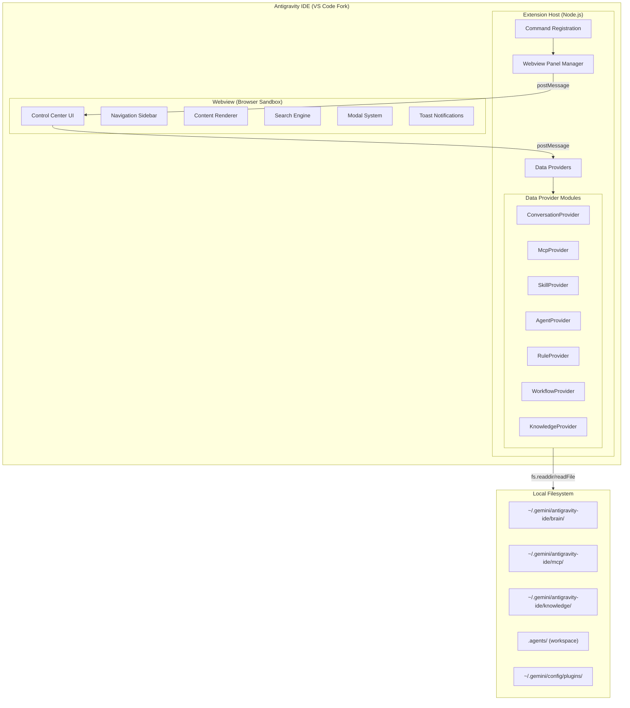

# Antigravity Control Center — Implementation Plan

> **Version:** 2.4.0  
> **Date:** 2026-06-16  
> **Status:** Approved — Full Conversation Discovery, Inline Actions & Cross-Workspace Multi-LS Broadcast Rename  
> **PRD Reference:** [acc.PRD.md](file:///Users/firo/tenn/firothehero/antigravity-control-center/documentation/acc.PRD.md)

---

## Table of Contents

1. [Architecture Overview](#1-architecture-overview)
2. [Project Structure](#2-project-structure)
3. [Phase 1 — Foundation (MVP)](#3-phase-1--foundation-mvp)
4. [Phase 2 — Skills & Agents](#4-phase-2--skills--agents)
5. [Phase 3 — Power Features](#5-phase-3--power-features)
6. [Testing Strategy](#6-testing-strategy)
7. [Build & Distribution](#7-build--distribution)
8. [Risk Register](#8-risk-register)
9. [Progress Tracker](#9-progress-tracker)

---

## 1. Architecture Overview

### 1.1 High-Level Architecture

The extension follows a **three-layer** architecture:



### 1.2 Data Flow

```
User clicks "Control Center" button
  → VS Code command fires
  → Extension creates/reveals WebviewPanel
  → Webview sends `request:*` message
  → Extension host reads filesystem
  → Extension sends `data:*` message back
  → Webview renders data in UI
```

### 1.3 Technology Decisions

| Decision | Choice | Rationale |
|---|---|---|
| **Extension Language** | TypeScript 5.x | VS Code extensions are first-class TypeScript; type safety for complex data models; antigravity-sdk compatibility |
| **Webview UI** | Vanilla HTML/CSS/JS (no React/Vue) | Webviews are sandboxed iframes — framework overhead is unnecessary for a dashboard; faster load; simpler CSP; full CSS control |
| **Build Tool** | esbuild | 100x faster than webpack; native VS Code extension template support; tree-shaking |
| **Markdown Rendering** | marked (in webview) | Lightweight, battle-tested Markdown→HTML converter; needed for skill/rule/KI rendering |
| **JSONL Parsing** | Custom streaming parser | `transcript.jsonl` files can be large; line-by-line parsing avoids loading entire files into memory |
| **YAML Frontmatter** | gray-matter | Standard library for extracting YAML frontmatter from Markdown files (SKILL.md metadata) |

---

## 2. Project Structure

```
antigravity-control-center/
├── .vscode/
│   ├── launch.json              # Extension debug configuration
│   └── tasks.json               # Build tasks
├── documentation/
│   ├── cc.PRD.md                # Product Requirements Document
│   └── cc_implementation_plan.md # This file
├── src/
│   ├── extension.ts             # Entry point: activate(), deactivate()
│   ├── commands/
│   │   └── openControlCenter.ts # Command handler for opening CC
│   ├── providers/
│   │   ├── conversationProvider.ts
│   │   ├── mcpProvider.ts
│   │   ├── skillProvider.ts
│   │   ├── agentProvider.ts
│   │   ├── ruleProvider.ts
│   │   ├── workflowProvider.ts
│   │   └── knowledgeProvider.ts
│   ├── webview/
│   │   ├── webviewManager.ts    # Creates/manages Webview panel
│   │   └── getWebviewContent.ts # Generates HTML for webview
│   ├── models/
│   │   ├── conversation.ts      # TypeScript interfaces
│   │   ├── mcpServer.ts
│   │   ├── skill.ts
│   │   ├── agent.ts
│   │   ├── rule.ts
│   │   ├── workflow.ts
│   │   └── knowledgeItem.ts
│   └── utils/
│       ├── paths.ts             # Data directory path resolution
│       ├── fileSystem.ts        # Safe filesystem read helpers
│       ├── jsonlParser.ts       # Streaming JSONL parser
│       └── markdownParser.ts    # Frontmatter + content extraction
├── media/
│   ├── webview/
│   │   ├── index.css            # Main webview stylesheet (design system)
│   │   ├── app.js               # Main webview JavaScript
│   │   ├── modules/
│   │   │   ├── conversations.js # Conversation UI module
│   │   │   ├── mcpServers.js    # MCP Servers UI module
│   │   │   ├── skills.js        # Skills UI module
│   │   │   ├── agents.js        # Agents UI module
│   │   │   ├── rules.js         # Rules UI module
│   │   │   ├── workflows.js     # Workflows UI module
│   │   │   ├── knowledge.js     # Knowledge Items UI module
│   │   │   └── settings.js      # Settings UI module
│   │   └── components/
│   │       ├── sidebar.js       # Navigation sidebar component
│   │       ├── searchBar.js     # Reusable search bar
│   │       ├── modal.js         # Modal dialog system
│   │       ├── toast.js         # Toast notification system
│   │       ├── card.js          # Reusable card component
│   │       ├── table.js         # Sortable data table
│   │       ├── skeleton.js      # Loading skeleton component
│   │       └── codeBlock.js     # Syntax-highlighted code block
│   └── icons/
│       └── control-center.svg   # Custom extension icon
├── testing/
│   ├── test_conversations.py    # Test conversation provider
│   ├── test_mcp_provider.py     # Test MCP provider
│   └── test_extension.py        # Integration tests
├── package.json                 # Extension manifest
├── tsconfig.json                # TypeScript configuration
├── esbuild.config.mjs           # esbuild bundler config
├── .eslintrc.json               # ESLint config
├── .vscodeignore                # Files to exclude from VSIX
├── CHANGELOG.md                 # Version changelog
├── LICENSE                      # License file
├── README.md                    # Extension README (for marketplace)
└── requirements.txt             # Python test dependencies
```

---

## 3. Phase 1 — Foundation (MVP)

**Goal:** Ship a working extension with the "Control Center" button, a beautiful dark-mode webview shell, and the two highest-value modules: Conversations and MCP Servers.

**Estimated Effort:** 5-7 days

---

### Task 1.1 — Project Scaffolding

**Depends on:** Nothing (starting point)  
**Files to create:** `package.json`, `tsconfig.json`, `esbuild.config.mjs`, `.vscode/launch.json`, `.vscode/tasks.json`, `.eslintrc.json`, `.vscodeignore`, `CHANGELOG.md`

#### Checklist

- [x] **1.1.1** Initialize npm project in `antigravity-control-center/` via `npm init -y`
- [x] **1.1.2** Install dev dependencies: `@types/vscode`, `typescript`, `esbuild`, `@types/node`, `eslint`
- [x] **1.1.3** Install runtime dependency: `gray-matter`
- [x] **1.1.4** Create `package.json` extension manifest with:
  - [x] Extension metadata (`name`, `displayName`, `description`, `version: 0.1.0`, `publisher: tenn-ai`)
  - [x] Engine requirement: `"vscode": "^1.85.0"`
  - [x] Activation event: `"*"` (activate on IDE startup)
  - [x] Main entry: `"./dist/extension.js"`
  - [x] Command contribution: `controlCenter.open` with title "Control Center" and icon `$(dashboard)`
  - [x] Menu contribution: `editor/title` → `controlCenter.open` in `navigation` group
  - [x] Configuration contribution: `controlCenter.openMode` (webview|external), `controlCenter.defaultTab`, `controlCenter.dataDirectory`
  - [x] NPM scripts: `"build"`, `"watch"`, `"lint"`, `"package"`
- [x] **1.1.5** Create `tsconfig.json` with:
  - [x] Target: `ES2022`, Module: `commonjs`
  - [x] Strict mode enabled
  - [x] `outDir: dist`, `rootDir: src`
  - [x] Source maps enabled
  - [x] `resolveJsonModule: true`, `skipLibCheck: true`
  - [x] Exclude: `node_modules`, `dist`, `media`
- [x] **1.1.6** Create `esbuild.config.mjs` with:
  - [x] Entry point: `src/extension.ts`
  - [x] Output: `dist/extension.js`
  - [x] Bundle mode with `vscode` as external
  - [x] Platform: `node`, target: `node18`
  - [x] Watch mode support via `--watch` flag
  - [x] Minification in production, source maps always
- [x] **1.1.7** Create `.vscode/launch.json` with Extension Development Host configuration:
  - [x] `extensionDevelopmentPath` pointed to workspace folder
  - [x] `outFiles` pointed to `dist/**/*.js`
  - [x] `preLaunchTask: build`
- [x] **1.1.8** Create `.vscode/tasks.json` with build and watch tasks:
  - [x] `build` task runs `npm run build`
  - [x] `watch` task runs `npm run watch` in background
- [x] **1.1.9** Create `.eslintrc.json` with TypeScript-aware ESLint config
- [x] **1.1.10** Create `.vscodeignore` excluding `src/`, `testing/`, `documentation/`, `node_modules/`, `*.ts`, config files
- [x] **1.1.11** Create initial `CHANGELOG.md` with v0.1.0 section

#### Verification
- [x] `npm install` completes without errors
- [x] `npm run build` compiles successfully and produces `dist/extension.js`
- [x] `npm run watch` starts esbuild in watch mode
- [x] Extension loads in Extension Development Host (F5) without activation errors

---

### Task 1.2 — Extension Entry Point & Command Registration

**Depends on:** Task 1.1  
**Files to create:** `src/extension.ts`, `src/commands/openControlCenter.ts`

#### Checklist

- [x] **1.2.1** Create `src/extension.ts`:
  - [x] Import `vscode` and `openControlCenter` command handler
  - [x] Implement `activate(context)` function that:
    - [x] Logs activation message to console
    - [x] Registers `controlCenter.open` command via `vscode.commands.registerCommand`
    - [x] Pushes disposable to `context.subscriptions`
  - [x] Implement empty `deactivate()` function
- [x] **1.2.2** Create `src/commands/openControlCenter.ts`:
  - [x] Maintain singleton `webviewManager` reference at module level
  - [x] Implement `openControlCenter(context)` function that:
    - [x] If `webviewManager` exists → call `reveal()` (bring to front, no duplicate)
    - [x] If not → create new `WebviewManager(context)`
    - [x] Subscribe to `onDidDispose` to clear the singleton reference
- [x] **1.2.3** Verify command is wired correctly in `package.json` contributes section

#### Verification
- [x] "Control Center" button appears in the top-right toolbar of the editor
- [x] Clicking the button opens a new webview panel tab
- [x] Clicking the button a second time reveals the existing panel (does not create a duplicate)
- [x] Closing the panel and clicking the button again creates a fresh panel
- [x] No error in the Extension Development Host console

---

### Task 1.3 — Utility Modules

**Depends on:** Task 1.1  
**Files to create:** `src/utils/paths.ts`, `src/utils/fileSystem.ts`, `src/utils/jsonlParser.ts`, `src/utils/markdownParser.ts`

#### 1.3.A — Path Resolution (`paths.ts`)

- [x] **1.3.1** Implement `getDataDirectory()`
- [x] **1.3.2** Implement `getBrainDirectory()` → `{dataDir}/brain/`
- [x] **1.3.3** Implement `getMcpDirectory()` → `{dataDir}/mcp/`
- [x] **1.3.4** Implement `getKnowledgeDirectory()` → `{dataDir}/knowledge/`
- [x] **1.3.5** Implement `getWorkspaceAgentsDirectory()`
- [x] **1.3.6** Implement `getGlobalPluginsDirectory()` → `~/.gemini/config/plugins/`
- [x] **1.3.7** Use `path.join()` for all path construction (cross-platform safety)

#### 1.3.B — Filesystem Helpers (`fileSystem.ts`)

- [x] **1.3.8** Implement `safeReadDir(dirPath)`
- [x] **1.3.9** Implement `safeReadFile(filePath)`
- [x] **1.3.10** Implement `safeReadJson<T>(filePath)`
- [x] **1.3.11** Implement `directoryExists(dirPath)`
- [x] **1.3.12** Implement `getSubDirectories(dirPath)`
- [x] **1.3.13** Implement `getFileStat(filePath)`

#### 1.3.C — JSONL Parser (`jsonlParser.ts`)

- [x] **1.3.14** Define `TranscriptStep` interface
- [x] **1.3.15** Implement `parseJsonl(content: string): TranscriptStep[]`
- [x] **1.3.16** Implement `parseJsonlPaginated(content, page, pageSize)`

#### 1.3.D — Markdown Parser (`markdownParser.ts`)

- [x] **1.3.17** Define `ParsedMarkdown` interface
- [x] **1.3.18** Implement `parseMarkdown(raw)` using `gray-matter`
- [x] **1.3.19** Implement `extractTitle(raw)`

#### Verification
- [x] All path functions return correct absolute paths on macOS
- [x] `safeReadDir` and `safeReadFile` return empty/null for non-existent paths (no throws)
- [x] `parseJsonl` correctly parses a sample `transcript.jsonl` file
- [x] `parseMarkdown` correctly extracts frontmatter from a `SKILL.md` file
- [x] TypeScript compiles all utility files without errors

---

### Task 1.4 — Data Models (TypeScript Interfaces)

**Depends on:** Task 1.1  
**Files to create:** `src/models/conversation.ts`, `src/models/mcpServer.ts`, `src/models/skill.ts`, `src/models/agent.ts`, `src/models/rule.ts`, `src/models/workflow.ts`, `src/models/knowledgeItem.ts`, `src/models/index.ts`

#### Checklist

- [x] **1.4.1** Create `conversation.ts`
- [x] **1.4.2** Create `mcpServer.ts`
- [x] **1.4.3** Create `skill.ts`
- [x] **1.4.4** Create `agent.ts`
- [x] **1.4.5** Create `rule.ts`
- [x] **1.4.6** Create `workflow.ts`
- [x] **1.4.7** Create `knowledgeItem.ts`
- [x] **1.4.8** Create `index.ts` barrel file re-exporting all model interfaces
- [x] **1.4.9** Create `messages.ts` / `MessageType` union in `index.ts` for all webview ↔ extension message types

#### Verification
- [x] TypeScript compiles all model files without errors
- [x] All interfaces are importable via `'../models'` barrel import
- [x] Message types cover all planned extension ↔ webview communication

---

### Task 1.5 — Data Providers (Conversations & MCP)

**Depends on:** Tasks 1.3, 1.4  
**Files to create:** `src/providers/conversationProvider.ts`, `src/providers/mcpProvider.ts`

#### 1.5.A — Conversation Provider

- [x] **1.5.1** Implement `getConversations(): Promise<Conversation[]>` — with SQLite `.db` + `.pb` scanning, title override, cross-workspace project detection, viewability filtering, sorted by lastModified desc
- [x] **1.5.2** Implement `getConversationDetail(id): Promise<ConversationDetail | null>`
- [x] **1.5.3** Implement `getConversationTranscriptPage(id, page, pageSize)` — paginated loading
- [x] **1.5.4** Implement `searchConversations(query): Promise<Conversation[]>`
- [x] **1.5.5** Implement `renameConversation(id, newTitle)` — multi-strategy ConnectRPC + filesystem override
- [x] **1.5.6** Implement `deleteConversation(id)` — removes brain dir, .db, .pb, WAL files
- [x] **1.5.7** Implement `addConversationMessage(id, content)` — appends user step to transcript

#### 1.5.B — MCP Provider

- [x] **1.5.8** Implement `getMcpServers(): Promise<McpServer[]>`
- [x] **1.5.9** Implement `getMcpToolDetail(serverName, toolName): Promise<McpTool | null>`

#### Verification
- [x] `getConversations()` returns correct data from all discovery sources (brain + conversations/ dir)
- [x] Conversation titles use title_override.txt, then SDK, then first USER_INPUT
- [x] `getConversationDetail()` parses transcript.jsonl correctly
- [x] `getMcpServers()` returns correct data from real `~/.gemini/antigravity-ide/mcp/` directory
- [x] Tool schemas parse correctly with all parameters visible
- [x] All functions handle missing/corrupted data gracefully (no throws)

---

### Task 1.6 — Webview Manager & HTML Generation

**Depends on:** Tasks 1.2, 1.5  
**Files to create:** `src/webview/webviewManager.ts`, `src/webview/getWebviewContent.ts`

#### 1.6.A — Webview Manager

- [x] **1.6.1** Create `WebviewManager` class with private panel, disposables, and `onDidDispose` event
- [x] **1.6.2** Implement constructor with `WebviewPanel` creation, HTML, message handler, dispose handler
- [x] **1.6.3** Implement `reveal()` method
- [x] **1.6.4** Implement `handleMessage(message)` dispatcher for all `request:*` → `data:*` message types
- [x] **1.6.5** Implement `dispose()`

#### 1.6.B — HTML Content Generator

- [x] **1.6.6** Implement `getWebviewContent(webview, extensionUri)` with nonce, CSP, Google Fonts, and all script/style tags

#### Verification
- [x] Webview panel opens with styled HTML content (not blank)
- [x] CSP does not block any resources
- [x] Google Fonts (Inter) loads correctly in the webview
- [x] CSS stylesheet applies correctly (dark background, styled elements)
- [x] JavaScript initializes and VS Code API is acquired
- [x] Messages flow correctly: webview → extension → webview (round-trip test)
- [x] `retainContextWhenHidden` preserves state when panel is hidden/shown

---

### Task 1.7 — Webview UI: Design System & Shell

**Depends on:** Task 1.6  
**Files to create:** `media/webview/index.css`, `media/webview/app.js`, `media/webview/components/sidebar.js`, `media/webview/components/searchBar.js`, `media/webview/components/modal.js`, `media/webview/components/toast.js`, `media/webview/components/card.js`, `media/webview/components/table.js`, `media/webview/components/skeleton.js`, `media/webview/components/codeBlock.js`

#### 1.7.A — Design System CSS (`index.css`)

- [x] **1.7.1** Define CSS custom properties (design tokens): colors, spacing, typography, radii, shadows, transitions, z-index
- [x] **1.7.2** Define base/reset styles: box-sizing, body dark background, scrollbar styling, selection
- [x] **1.7.3** Define layout grid: `.app-shell`, `.sidebar`, `.content-area`, `.top-bar`, `.status-bar`
- [x] **1.7.4** Define sidebar component styles with collapse/expand animation
- [x] **1.7.5** Define card component styles with hover effects
- [x] **1.7.6** Define table component styles
- [x] **1.7.7** Define search bar styles
- [x] **1.7.8** Define modal styles with fade animation
- [x] **1.7.9** Define toast styles with slide-in and auto-dismiss
- [x] **1.7.10** Define skeleton loading styles with shimmer animation
- [x] **1.7.11** Define code block styles with copy button
- [x] **1.7.12** Define utility classes (text, badges, buttons, flex, visibility)
- [x] **1.7.13** Define responsive breakpoints for sidebar collapse

#### 1.7.B — Main Application Controller (`app.js`)

- [x] **1.7.14** Acquire VS Code API via `acquireVsCodeApi()`
- [x] **1.7.15** Implement state management with `currentModule`, `moduleData`, `searchQuery`, `vscode.setState()`
- [x] **1.7.16** Implement message listener routing `data:*` and `error:*` messages
- [x] **1.7.17** Implement navigation handler with fade transitions and active state
- [x] **1.7.18** Implement debounced search (300ms)
- [x] **1.7.19** Implement module renderer dispatch with skeleton loader
- [x] **1.7.20** Implement global keyboard shortcuts (ESC, Cmd+K, Cmd+R)

#### 1.7.C — Component JS Files

- [x] **1.7.21** `sidebar.js` — nav items, click events, active state, collapse/expand, count badges
- [x] **1.7.22** `searchBar.js` — debounced input, clear button, results count
- [x] **1.7.23** `modal.js` — show/hide, overlay click-to-close, ESC, focus trap, fade animation
- [x] **1.7.24** `toast.js` — 4 types, auto-dismiss, progress bar, stack up to 5
- [x] **1.7.25** `card.js` — hover effects, action buttons, click handler
- [x] **1.7.26** `table.js` — sortable columns, row hover, row click, empty state
- [x] **1.7.27** `skeleton.js` — card-list, table, detail placeholders with shimmer
- [x] **1.7.28** `codeBlock.js` — monospace, line numbers, copy-to-clipboard

#### Verification
- [x] UI shell renders with full dark-mode design system applied
- [x] Sidebar navigation switches between modules with smooth transitions
- [x] Search bar debounces and shows clear button
- [x] Modal opens/closes with fade animation
- [x] Toasts stack, auto-dismiss, slide in from right
- [x] Cards show hover effects
- [x] Table sorts by column click
- [x] Skeleton loaders animate with shimmer
- [x] Code blocks render with copy button
- [x] Keyboard shortcuts work (ESC, Cmd+K, Cmd+R)
- [x] Sidebar collapses to icons at narrow widths
- [x] No browser popups used anywhere

---

### Task 1.8 — Webview UI: Conversations Module

**Depends on:** Tasks 1.5.A, 1.7  
**Files to create:** `media/webview/modules/conversations.js`

#### Checklist

- [x] **1.8.1** Implement `renderConversationList(container, conversations)`:
  - [x] Render card for each conversation in Column 2 showing title, step count, relative date, and project badge
  - [x] Sorted by reverse chronological order (newest first)
- [x] **1.8.2** Implement search & Project filter in Column 2:
  - [x] Case-insensitive query filtering on conversation titles
  - [x] Dropdown select filter by Project/Repository name
- [x] **1.8.3** Implement premium embedded Chat history in Column 3:
  - [x] Color-coded message bubbles: User (blue accent), Agent (violet accent), System (centered/muted)
  - [x] Collapsible tool call accordions showing tool arguments and response JSON blocks
  - [x] Automatic default selection of first conversation on load
- [x] **1.8.4** Native Antigravity-style Chat Input (Phase 2 — 2026-05-30):
  - [x] **Native model selector pill** — `[+] Gemini 3.5 Flash (Medium) ▼` matching Antigravity's exact UI
  - [x] **Model dropdown** — full list: Gemini 3.5 Flash (M/H/L), Gemini 3.1 Pro (L/H), Claude Sonnet/Opus 4.6 (Thinking), GPT-OSS 120B (Medium)
  - [x] Microphone icon and Send button matching Antigravity's style
  - [x] `acc-textarea` with auto-grow (min 1 row, max 160px), Enter to send, Shift+Enter for newline
  - [x] **`ModelCatalogService`** — `src/services/modelCatalog.ts` provides the canonical model list
  - [x] **`request:modelCatalog` / `data:modelCatalog`** message protocol to deliver models to the webview
- [x] **1.8.5** Real-time Streaming Chat Updates (Phase 2 — 2026-05-30):
  - [x] **`ConversationWatcher`** — `src/services/conversationWatcher.ts` watches `transcript.jsonl` with `fs.watch`
  - [x] Debounced file change detection reads only new bytes appended since last check
  - [x] `stream:conversationSteps` message type pushes `newSteps[]` and `totalStepCount` to webview
  - [x] `onStreamUpdate()` in `conversations.js` appends new bubbles **without re-rendering** the whole history
  - [x] Streaming indicator bar with pulsing dot: "Agent is responding…" shown while steps arrive
  - [x] Support for watching **multiple conversations simultaneously** (multi-watch registry)
- [x] **1.8.6** Conversation Renaming (Phase 2 — 2026-05-30):
  - [x] Rename button (pencil icon) in conversation header
  - [x] Custom modal input (no browser popup) with keyboard shortcut (Enter to confirm)
  - [x] `request:renameConversation` → `renameConversation()` writes `title_override.txt` in brain directory
  - [x] `action:renameSuccess` response updates both header and Column 2 list in real-time
  - [x] Title override is respected by both `getConversations()` and `getConversationDetail()` providers
- [x] **1.8.7** Send Message Integration (Phase 2 — 2026-05-30):
  - [x] `request:sendMessage` appends user step to `transcript.jsonl` via `addConversationMessage()`
  - [x] The running Antigravity agent reads the new user message and responds (visible via real-time file watcher)
  - [x] Model ID is included in payload for future agent routing

#### Verification
- [x] Conversation list populates from real brain directory data
- [x] Titles show the first user message, not UUID (or custom renamed title)
- [x] Relative dates display correctly ("2 hours ago", etc.)
- [x] Clicking a card opens the detail view with transcript
- [x] Transcript messages are color-coded by source
- [x] Tool call sections expand/collapse correctly
- [x] Search filters the list in real-time as user types
- [x] Skeleton loaders show during data loading
- [x] Native model selector shows full model list matching Antigravity UI
- [x] Model dropdown opens/closes on click, selection persists
- [x] Rename modal opens with current title, keyboard Enter confirms
- [x] Real-time streaming updates append new steps without full re-render
- [x] Streaming "Agent is responding…" bar shows while agent is active

---

### Task 1.9 — Webview UI: MCP Servers Module

**Depends on:** Tasks 1.5.B, 1.7  
**Files to create:** `media/webview/modules/mcpServers.js`

#### Checklist

- [ ] **1.9.1** Implement `renderMcpServerList(container, servers)`:
  - [ ] Card per server showing:
    - [ ] Server name (formatted: `cloudrun` → `Cloud Run`)
    - [ ] Tool count badge (`"15 tools"`)
    - [ ] "Has Instructions" indicator icon (📋)
    - [ ] Eager vs lazy tool count breakdown
  - [ ] Empty state: "No MCP servers configured" message
- [ ] **1.9.2** Implement expandable tool list within server cards:
  - [ ] Click card → expand to show tool list below
  - [ ] Each tool row: name, truncated description, parameter count badge
  - [ ] Click tool row → open tool schema detail view
  - [ ] Smooth expand/collapse animation
- [ ] **1.9.3** Implement `renderToolSchemaDetail(container, serverName, tool)`:
  - [ ] "← Back to servers" link at top
  - [ ] Header: tool name, server name badge
  - [ ] Description rendered as formatted text (support basic markdown)
  - [ ] Parameters section:
    - [ ] Table: parameter name, type, required/optional badge, description
    - [ ] Nested object parameters shown with indentation
  - [ ] Raw JSON schema in collapsible code block (for debugging)
- [ ] **1.9.4** Implement server instructions viewer:
  - [ ] If server has `instructions.md`, show "View Instructions" button
  - [ ] Click → modal with rendered markdown instructions
- [ ] **1.9.5** Implement MCP search/filter:
  - [ ] Search across: server names, tool names, tool descriptions
  - [ ] Highlight matching text in results
  - [ ] Auto-expand servers containing matching tools
- [ ] **1.9.6** Implement loading states:
  - [ ] Skeleton card list while `request:mcpServers` is pending
- [ ] **1.9.7** Wire up message passing:
  - [ ] On module activation → post `request:mcpServers`
  - [ ] On tool click → post `request:mcpToolDetail` with server and tool names

#### Verification
- [ ] All MCP servers from `~/.gemini/antigravity-ide/mcp/` appear in the list
- [ ] Tool counts are accurate
- [ ] Expanding a server card reveals all its tools
- [ ] Tool schema detail view shows all parameters with types
- [ ] JSON schema renders correctly in code block
- [ ] Instructions modal shows rendered markdown
- [ ] Search finds tools across all servers (e.g., searching "screenshot" finds `take_screenshot` in `chrome-devtools-mcp`)
- [ ] Skeleton loaders show during data loading

---

### Task 1.10 — Custom Extension Icon & Polish

**Depends on:** Task 1.6  
**Files to create:** `media/icons/control-center.svg`

#### Checklist

- [ ] **1.10.1** Design custom SVG icon:
  - [ ] Dashboard/control panel motif (grid of squares/circles)
  - [ ] Works at 16x16, 24x24, and 48x48 sizes
  - [ ] Single path, no fills that depend on theme (use `currentColor`)
- [ ] **1.10.2** Reference icon in `package.json`:
  - [ ] Update `contributes.commands[0].icon` to use custom SVG path
  - [ ] Add light/dark theme variants if needed
- [ ] **1.10.3** Add extension icon for marketplace:
  - [ ] 128x128 PNG icon for `package.json` `"icon"` field
- [x] **1.10.4** Add status bar item:
  - [x] Small branded "ACC" status bar button with custom logo icon in bottom right status bar
  - [x] Click → same `controlCenter.open` command
  - [x] Branded custom icon registered in package.json contributes.icons
- [x] **1.10.5** Polish the tab title & native standalone floating window:
  - [x] Set `panel.iconPath` to the extension icon for the editor tab
  - [x] Implement Native Pop-Out Button (`#global-popout-btn`) inside webview top header bar next to refresh button
  - [x] Clicking `#global-popout-btn` posts `request:popOut` to host extension, triggering native `workbench.action.moveEditorToNewWindow` to move the webview tab to its own native standalone floating window

#### Verification
- [x] Icon displays correctly in editor title bar in both light and dark themes
- [x] Icon is readable at small sizes (16x16)
- [x] Custom status bar item with branded logo and "ACC" text appears and is clickable
- [x] Webview header shows Pop-Out icon button next to refresh button
- [x] Clicking Pop-Out button natively detaches/floats the tab into its own Electron standalone window without external browser launching
- [x] Editor tab shows custom icon next to "⚡ Antigravity Control Center" title

---

### Phase 1 — End-to-End Verification Checklist

- [x] Extension installs via `.vsix` without errors
- [x] "Control Center" button visible in top-right toolbar
- [x] Clicking opens the dark-mode webview panel
- [x] Sidebar shows all 8 navigation items (Conversations, MCPs, Skills, Agents, Rules, Workflows, KIs, Settings)
- [x] Conversations module shows real conversation data from brain directory
- [x] Conversation detail view renders transcript with color-coded messages
- [x] MCP Servers module shows all configured servers with tool schemas
- [x] Tool schema detail view renders parameter tables
- [x] Search works in both Conversations and MCP modules
- [x] All 8 modules are fully functional (no "Coming Soon" placeholders)
- [x] No console errors in webview DevTools
- [x] Extension does not degrade IDE performance

---

## 4. Phase 2 — Skills & Agents

**Goal:** Add the remaining read-only management modules for Skills, Agents, Rules, Workflows, and Knowledge Items.

**Estimated Effort:** 4-5 days  
**Depends on:** Phase 1 complete

---

### Task 2.1 — Skills Provider & UI Module

**Files to create:** `src/providers/skillProvider.ts`, `media/webview/modules/skills.js`

#### 2.1.A — Skills Provider (`skillProvider.ts`)

- [x] **2.1.1** Implement `getWorkspaceSkills()` — scans `<workspace>/.agents/skills/`, parses SKILL.md frontmatter
- [x] **2.1.2** Implement `getGlobalSkills()` — scans `~/.gemini/config/plugins/` for plugin skills
- [x] **2.1.3** Implement `getAllSkills()` — merges workspace + global, sorted alphabetically
- [x] **2.1.4** Implement `getSkillDetail(sourcePath)` — reads full SKILL.md content
- [x] **2.1.5** Implement `searchSkills(query)` — searches name, description, content

#### 2.1.B — Skills UI Module (`skills.js`)

- [x] **2.1.6** Filter tabs: "All" | "Workspace" | "Global/Plugins" with counts
- [x] **2.1.7** Skill card list: name, description, source badge, subdirectory icons
- [x] **2.1.8** Skill detail view: back nav, header, SKILL.md as rich HTML, file browser
- [x] **2.1.9** Skill search across name, description, content
- [x] **2.1.10** Message passing wired up

#### Verification
- [x] All workspace skills from `.agents/skills/` appear in the list
- [x] All global plugin skills from `~/.gemini/config/plugins/` appear in the list
- [x] Source badges correctly identify workspace vs plugin skills
- [x] Filter tabs work and show correct counts
- [x] Skill detail view renders SKILL.md as formatted HTML
- [x] Search finds skills by name, description, and content

---

### Task 2.2 — Agents Provider & UI Module

**Files to create:** `src/providers/agentProvider.ts`, `media/webview/modules/agents.js`

#### Checklist

- [x] **2.2.1** Implement `agentProvider.ts` — scans `.agents/agents/`, parses frontmatter, extracts name/description/model/skills/tools
- [x] **2.2.2** `agents.js` list view: card per agent with name, model badge, skill/tool counts
- [x] **2.2.3** Agent detail view: full config, skills list, tools list, model info, raw config block
- [x] **2.2.4** Agent search by name, model, skill names
- [x] **2.2.5** Message passing wired up

#### Verification
- [x] Agent definitions from `.agents/agents/` display correctly
- [x] Model badges show correct model names
- [x] Skill/tool counts are accurate
- [x] Detail view shows full configuration
- [x] Search works

---

### Task 2.3 — Rules Provider & UI Module

**Files to create:** `src/providers/ruleProvider.ts`, `media/webview/modules/rules.js`

#### Checklist

- [x] **2.3.1** Implement `ruleProvider.ts` — scans `.agents/rules/`, extracts name from filename, reads content, generates preview
- [x] **2.3.2** `rules.js` list view: card per rule with name, preview, file size
- [x] **2.3.3** Rule detail view: full markdown as rich HTML, file path display
- [x] **2.3.4** Rule search across names and content
- [x] **2.3.5** Message passing wired up
- [x] **2.3.6** "Open in Editor" handler — opens file via `vscode.window.showTextDocument()`

#### Verification
- [x] Rules from `.agents/rules/` display with correct names
- [x] Preview text shows meaningful content preview
- [x] Detail view renders full markdown correctly
- [x] Search works across names and content

---

### Task 2.4 — Workflows Provider & UI Module

**Files to create:** `src/providers/workflowProvider.ts`, `media/webview/modules/workflows.js`

#### Checklist

- [x] **2.4.1** Implement `workflowProvider.ts` — scans `.agents/workflows/`, derives slash command from filename, extracts description
- [x] **2.4.2** `workflows.js` list view: table with slash command (code pill), filename, description
- [x] **2.4.3** Workflow detail view: header, rendered markdown, usage hint
- [x] **2.4.4** Workflow search by slash command, filename, description
- [x] **2.4.5** Message passing wired up

#### Verification
- [x] All workflows from `.agents/workflows/` display with correct slash commands
- [x] Slash commands are formatted as styled code pills
- [x] Detail view renders workflow content as rich HTML
- [x] Search finds workflows by command name

---

### Task 2.5 — Knowledge Items Provider & UI Module

**Files to create:** `src/providers/knowledgeProvider.ts`, `media/webview/modules/knowledge.js`

#### Checklist

- [x] **2.5.1** Implement `knowledgeProvider.ts` — scans `~/.gemini/antigravity-ide/knowledge/`, reads metadata.json, lists artifacts, sorted by last accessed
- [x] **2.5.2** Implement `getKnowledgeArtifact(kiId, artifactPath)` — reads artifact markdown file
- [x] **2.5.3** `knowledge.js` list view: card per KI with title, truncated summary, last accessed date, artifact count
- [x] **2.5.4** KI detail view: title, full summary, references, artifact browser with click-to-render
- [x] **2.5.5** KI search across titles and summaries
- [x] **2.5.6** Message passing wired up

#### Verification
- [x] Knowledge Items from `~/.gemini/antigravity-ide/knowledge/` display correctly
- [x] Metadata (summary, timestamps, references) renders
- [x] Artifact browser lists all files in `artifacts/` subdirectory
- [x] Clicking an artifact renders its markdown content
- [x] Search finds KIs by title and summary

---

### Task 2.6 — Settings Module

**Files to create:** `media/webview/modules/settings.js`

#### Checklist

- [x] **2.6.1** Settings UI layout: Data Directory section, Preferences (default tab, model), Data Management (refresh), About (version, links)
- [x] **2.6.2** Settings read/write: reads VS Code config on load, saves changes via messages, success toast
- [x] **2.6.3** "Open in Finder" command handler
- [x] **2.6.4** Message passing wired up

#### Verification
- [x] Data directory path displays correctly
- [x] Settings preferences save correctly to VS Code settings
- [x] "Refresh All Data" triggers a full reload
- [x] About section shows correct version info

---

### Phase 2 — End-to-End Verification Checklist

- [x] All 8 sidebar modules are fully functional (no "Coming Soon" placeholders)
- [x] Skills module shows workspace + global skills with source badges
- [x] Agents module shows agent configs with model/skill/tool info
- [x] Rules module shows all rules with rendered markdown
- [x] Workflows module shows all workflows with slash commands
- [x] Knowledge Items module shows KIs with artifact browser
- [x] Settings module allows preference changes and shows About info
- [x] Search works across all modules
- [x] Navigation between all modules is smooth

---

## 5. Phase 3 — Power Features

**Goal:** Add write operations, analytics, external window mode, and advanced capabilities.

**Estimated Effort:** 5-7 days  
**Depends on:** Phase 2 complete

---

### Task 3.1 — CRUD Operations for Skills, Rules, Workflows

**Files to modify:** `src/providers/*.ts`, `media/webview/modules/*.js`  
**Files to create:** `src/services/fileOperations.ts`

#### Checklist

- [ ] **3.1.1** Implement `fileOperations.ts` service:
  - [ ] `createFile(dirPath, filename, templateContent)` → creates file with template
  - [ ] `updateFile(filePath, content)` → overwrites file content
  - [ ] `deleteFile(filePath)` → removes file after validation
  - [ ] `createDirectory(dirPath)` → creates directory structure
  - [ ] All operations wrapped in try/catch with meaningful error messages
- [ ] **3.1.2** Implement "Create New Skill" flow:
  - [ ] "Create Skill" button in skills module header
  - [ ] Modal form: skill name input, description input, source directory selector
  - [ ] Template generation: creates directory + `SKILL.md` with frontmatter template
  - [ ] Success toast → auto-refresh skill list
  - [ ] Error handling with specific messages (directory exists, permission denied)
- [ ] **3.1.3** Implement "Edit Skill" flow:
  - [ ] "Edit" button in skill detail view
  - [ ] Switches to inline editor: `<textarea>` with monospace font
  - [ ] Side-by-side: editor (left) + live markdown preview (right)
  - [ ] "Save" button → posts content to extension host → `updateFile()`
  - [ ] "Cancel" button → reverts to read-only view
  - [ ] "Open in Editor" button → opens in VS Code native editor
  - [ ] Success/error toast feedback
- [ ] **3.1.4** Implement "Delete Skill" flow:
  - [ ] "Delete" button with danger styling
  - [ ] Confirmation modal: "Are you sure you want to delete 'skill-name'? This cannot be undone."
  - [ ] Type skill name to confirm (for destructive safety)
  - [ ] Extension host removes directory via `fs.rm(path, { recursive: true })`
  - [ ] Success toast → auto-refresh skill list
- [ ] **3.1.5** Replicate CRUD for Rules:
  - [ ] Create: modal with name + content editor → creates `.md` file in `.agents/rules/`
  - [ ] Edit: inline editor with live preview
  - [ ] Delete: confirmation modal with name verification
- [ ] **3.1.6** Replicate CRUD for Workflows:
  - [ ] Create: modal with slash command name + content → creates `.md` file
  - [ ] Edit: inline editor with live preview
  - [ ] Delete: confirmation modal
- [ ] **3.1.7** Add undo support:
  - [ ] Before any write/delete, backup original content in memory
  - [ ] Show "Undo" action in success toast (5-second window)
  - [ ] Undo restores original file content

#### Verification
- [ ] Creating a new skill generates correct directory + SKILL.md structure
- [ ] Editing a skill saves content to disk correctly
- [ ] Deleting a skill removes the directory
- [ ] All operations show appropriate success/error toasts
- [ ] Confirmation modals prevent accidental deletion
- [ ] Undo works within the 5-second window
- [ ] File changes are reflected immediately in the UI after refresh

---

### Task 3.2 — Conversation Export

**Files to modify:** `src/webview/webviewManager.ts`, `media/webview/modules/conversations.js`  
**Files to create:** `src/services/exportService.ts`

#### Checklist

- [ ] **3.2.1** Implement `exportService.ts`:
  - [ ] `exportAsMarkdown(detail: ConversationDetail): string` → formatted Markdown with user/agent labels, timestamps, tool calls as code blocks
  - [ ] `exportAsJson(detail: ConversationDetail): string` → pretty-printed JSON of raw transcript steps
  - [ ] `exportAsHtml(detail: ConversationDetail): string` → standalone HTML document with embedded dark-mode CSS, styled transcript
- [ ] **3.2.2** Enable "Export" button on conversation cards and detail view
- [ ] **3.2.3** Implement export modal:
  - [ ] Format selector: Markdown / JSON / HTML (radio buttons with preview icons)
  - [ ] "Export" button → sends format + conversation ID to extension host
- [ ] **3.2.4** Extension host export handler:
  - [ ] Generate export content based on format
  - [ ] Show `vscode.window.showSaveDialog()` with appropriate file filter
  - [ ] Write file to selected location via `fs.writeFile()`
  - [ ] Success toast with "Open File" action
- [ ] **3.2.5** Implement "Copy to Clipboard" option:
  - [ ] For Markdown and JSON formats, offer clipboard copy as alternative
  - [ ] Uses `vscode.env.clipboard.writeText()`

#### Verification
- [ ] Markdown export produces well-formatted, readable transcript
- [ ] JSON export preserves all transcript data
- [ ] HTML export opens in browser with correct styling
- [ ] Save dialog suggests appropriate file extension
- [ ] "Open File" action in toast opens exported file
- [ ] Clipboard copy works for Markdown/JSON formats

---

### Task 3.3 — Conversation Analytics Dashboard

**Files to create:** `media/webview/modules/analytics.js`, `media/webview/components/charts.js`

#### Checklist

- [ ] **3.3.1** Implement `charts.js` SVG charting library:
  - [ ] `renderBarChart(container, { data, labels, colors })` → vertical bar chart
  - [ ] `renderLineChart(container, { data, labels })` → line with dots
  - [ ] `renderHorizontalBarChart(container, { data, labels })` → horizontal bars
  - [ ] `renderDonutChart(container, { segments })` → donut/pie chart
  - [ ] Tooltip on hover showing exact values
  - [ ] Responsive sizing
  - [ ] Smooth entry animations
- [ ] **3.3.2** Implement analytics summary cards:
  - [ ] Total conversations count
  - [ ] Total steps across all conversations
  - [ ] Average steps per conversation
  - [ ] Most active day/week
- [ ] **3.3.3** Implement "Conversations Over Time" bar chart:
  - [ ] Group conversations by day/week/month (toggle)
  - [ ] Show count per period
- [ ] **3.3.4** Implement "Average Step Count Trend" line chart:
  - [ ] Trailing average of steps per conversation over time
- [ ] **3.3.5** Implement "Most Used Tools" horizontal bar chart:
  - [ ] Aggregate tool usage from all transcript `tool_calls`
  - [ ] Top 10 tools by frequency
- [ ] **3.3.6** Implement "Message Source Distribution" donut chart:
  - [ ] User vs Agent vs System message proportions
- [ ] **3.3.7** Add "Analytics" as a sub-tab within Conversations module or separate sidebar item
- [ ] **3.3.8** Wire up data aggregation in extension host:
  - [ ] New message type `request:analytics`
  - [ ] Aggregate data across all conversations
  - [ ] Cache results for performance

#### Verification
- [ ] All 4 chart types render correctly with real data
- [ ] Tooltips show accurate values on hover
- [ ] Charts animate smoothly on load
- [ ] Summary cards show correct aggregate numbers
- [ ] Time grouping toggle (day/week/month) works
- [ ] Analytics load within 2 seconds for 100+ conversations

---

### Task 3.4 — MCP Server Health Checks

**Files to modify:** `src/providers/mcpProvider.ts`, `media/webview/modules/mcpServers.js`

#### Checklist

- [ ] **3.4.1** Implement health check logic in `mcpProvider.ts`:
  - [ ] Check if MCP server process is running (via process list or port check)
  - [ ] Return status: `'running'` | `'stopped'` | `'unknown'`
  - [ ] Timeout after 3 seconds per server
- [ ] **3.4.2** Add status badges to MCP server cards:
  - [ ] Running: green dot + "Running"
  - [ ] Stopped: red dot + "Stopped"
  - [ ] Unknown: yellow dot + "Unknown"
- [ ] **3.4.3** Implement "Test Connection" button per server:
  - [ ] Attempts health check on demand
  - [ ] Shows loading spinner during check
  - [ ] Updates status badge with result
  - [ ] Toast with result message
- [ ] **3.4.4** Implement "Refresh All Health" button in MCP module header:
  - [ ] Runs health checks for all servers in parallel
  - [ ] Progress indicator during batch check

#### Verification
- [ ] Health status badges display for each server
- [ ] Running servers show green status
- [ ] "Test Connection" performs actual health check
- [ ] Batch refresh works and doesn't freeze UI
- [ ] Timeout handles unresponsive servers gracefully

---

### Task 3.5 — External Browser Window Mode

**Files to create:** `src/services/localServer.ts`  
**Files to modify:** `src/commands/openControlCenter.ts`, `src/extension.ts`  
**New dependencies:** `express`, `ws`

#### Checklist

- [ ] **3.5.1** Install optional dependencies: `express`, `ws`, `@types/express`, `@types/ws`
- [ ] **3.5.2** Implement `localServer.ts`:
  - [ ] Create Express server serving `media/webview/` static files
  - [ ] Find random available port via `server.listen(0)`
  - [ ] WebSocket endpoint for extension ↔ browser communication
  - [ ] Map all `postMessage` calls to WebSocket messages
  - [ ] CORS headers for local access only
  - [ ] Security: bind to `127.0.0.1` only (no external access)
- [ ] **3.5.3** Modify `openControlCenter.ts`:
  - [ ] Read `controlCenter.openMode` setting
  - [ ] If `"webview"` → existing WebviewPanel flow
  - [ ] If `"external"` → start local server → open `http://127.0.0.1:{port}` via `vscode.env.openExternal()`
- [ ] **3.5.4** Modify webview HTML for external mode:
  - [ ] Detect if running inside VS Code webview or standalone browser
  - [ ] If standalone: connect to WebSocket instead of using VS Code API
  - [ ] Adapter layer: same message interface, different transport
- [ ] **3.5.5** Implement server lifecycle management:
  - [ ] Start server on first external open
  - [ ] Keep server alive while extension is active
  - [ ] Stop server on `deactivate()` or when last browser tab closes
  - [ ] Handle port conflicts gracefully
- [ ] **3.5.6** Add visual indicator in external browser:
  - [ ] Banner: "Connected to Antigravity IDE" with connection status dot
  - [ ] Reconnect logic if WebSocket disconnects

#### Verification
- [ ] Setting `controlCenter.openMode` to `"external"` opens system browser
- [ ] UI in browser is identical to webview UI
- [ ] Data flows correctly via WebSocket (conversations, MCPs, etc.)
- [ ] Closing browser tab doesn't crash extension
- [ ] Multiple browser tabs share the same server
- [ ] Server shuts down cleanly on extension deactivate
- [ ] Security: server only accessible from localhost

---

### Task 3.6 — Inline Skill/Rule Editor

**Files to create:** `media/webview/components/markdownEditor.js`

#### Checklist

- [ ] **3.6.1** Implement `markdownEditor.js`:
  - [ ] Split-pane layout: editor (left) + preview (right)
  - [ ] Editor: `<textarea>` with monospace font, line numbers, tab key support
  - [ ] Preview: live-rendered markdown using `marked` library
  - [ ] Sync scroll between editor and preview
  - [ ] Debounced preview update (200ms)
- [ ] **3.6.2** Add toolbar above editor:
  - [ ] Bold (`Ctrl+B`), Italic (`Ctrl+I`), Code (`` Ctrl+` ``) formatting buttons
  - [ ] Heading dropdown (H1-H4)
  - [ ] Link insertion
  - [ ] List (ordered/unordered) insertion
  - [ ] Preview toggle (show/hide preview pane)
- [ ] **3.6.3** Add save/cancel controls:
  - [ ] "Save" button (primary style) → sends content to extension host
  - [ ] "Cancel" button → discards changes with confirmation if dirty
  - [ ] Dirty state indicator (dot on tab/title)
  - [ ] `Ctrl+S` keyboard shortcut for save
- [ ] **3.6.4** Integrate editor into skill detail view:
  - [ ] "Edit" button switches from rendered view to editor
  - [ ] "Preview" mode shows rendered view
  - [ ] Toggle between Edit and Preview modes

#### Verification
- [ ] Editor displays with monospace font and basic line numbers
- [ ] Live preview updates as user types (debounced)
- [ ] Toolbar buttons insert correct markdown syntax
- [ ] Save writes content to correct file path
- [ ] Cancel with unsaved changes shows confirmation modal
- [ ] `Ctrl+S` saves correctly
- [ ] Scroll sync between editor and preview works

---

### Phase 3 — End-to-End Verification Checklist

- [ ] Skills, Rules, Workflows can be created, edited, and deleted from the UI
- [ ] Conversations can be exported in Markdown, JSON, and HTML formats
- [ ] Analytics dashboard shows meaningful charts with real data
- [ ] MCP server health checks display correct status
- [ ] External browser mode works with full feature parity
- [ ] Inline markdown editor works for skills and rules
- [ ] All write operations show confirmation before executing
- [ ] Undo works within 5-second window for destructive operations
- [ ] No data loss in any operation
- [ ] Performance remains acceptable with all features enabled

---

## 6. Testing Strategy

### 6.1 Unit Tests

> **Note:** Only `testing/test_conversations.py` has been created. Additional test files are planned for Phase 3.

| Module | Test File | Status |
|---|---|---|
| Conversation provider | `testing/test_conversations.py` | 🟢 Exists |
| Path utilities | `testing/test_path_utils.py` | ⏳ Pending |
| Filesystem helpers | `testing/test_filesystem.py` | ⏳ Pending |
| JSONL parser | `testing/test_jsonl_parser.py` | ⏳ Pending |
| Markdown parser | `testing/test_markdown_parser.py` | ⏳ Pending |
| MCP provider | `testing/test_mcp_provider.py` | ⏳ Pending |
| Skill provider | `testing/test_skill_provider.py` | ⏳ Pending |
| Export service | `testing/test_export_service.py` | ⏳ Pending (Phase 3) |
| File operations | `testing/test_file_operations.py` | ⏳ Pending (Phase 3) |

### 6.2 Integration Tests

- [x] Extension activates without errors in Extension Development Host
- [x] Command `controlCenter.open` is registered and executable
- [x] Webview panel creates and displays correctly
- [x] All 8 data providers return data from real filesystem
- [x] Extension ↔ webview message round-trip works for all message types
- [x] Settings read/write through configuration API
- [x] "Open in Editor" command opens correct files

### 6.3 Manual Testing Checklist — Phase 1

- [x] "Control Center" button appears in top-right toolbar
- [x] Clicking button opens webview panel
- [x] Clicking button again reveals existing panel (no duplicate)
- [x] Navigation sidebar switches between all modules with smooth transitions
- [x] Conversations list populates from real data
- [x] Conversation titles show first user message (not UUID)
- [x] Conversation detail view renders transcript with color-coded messages
- [x] Transcript tool calls expand/collapse
- [x] Transcript pagination works for long conversations
- [x] MCP servers list shows all configured servers
- [x] MCP tool list expands within server cards
- [x] Tool schemas display parameters in structured table
- [x] Tool schema raw JSON renders in code block
- [x] Search works in Conversations module (filters by title)
- [x] Search works in MCP module (searches across servers, tools, descriptions)
- [x] Skeleton loaders appear during data loading
- [x] Toasts appear and auto-dismiss
- [x] Modals open/close correctly (no browser popups)
- [x] Dark mode renders correctly with all design tokens
- [x] Glassmorphism effects render (backdrop blur)
- [x] Sidebar collapses to icons at narrow width
- [x] Keyboard shortcuts work (ESC, Cmd+K, Cmd+R)
- [x] Copy button on code blocks works
- [x] Status bar shows ACC status item with branded logo
- [x] No console errors in webview DevTools
- [x] Extension does not degrade IDE performance

### 6.4 Manual Testing Checklist — Phase 2

- [x] Skills module shows all workspace and global skills
- [x] Skills filter tabs work (All / Workspace / Plugins)
- [x] Skill detail view renders SKILL.md as formatted HTML
- [x] Agents module shows all agent definitions
- [x] Agent detail shows model, skills, tools config
- [x] Rules module shows all rules with content previews
- [x] Rule detail view renders full markdown
- [x] Workflows module shows all workflows with slash commands
- [x] Workflow slash commands are styled as code pills
- [x] Knowledge Items module shows all KIs with metadata
- [x] KI artifact browser lists and renders artifact files
- [x] Settings module shows correct data directory
- [x] Settings preferences save correctly
- [x] "Refresh All Data" button works
- [x] Search works in all modules

### 6.5 Manual Testing Checklist — Phase 3

> Phase 3 not yet implemented. Items below are pending.

- [ ] Create new skill → generates correct directory + SKILL.md
- [ ] Edit skill → saves content to disk
- [ ] Delete skill → removes directory with confirmation
- [ ] CRUD works for rules
- [ ] CRUD works for workflows
- [ ] Conversation export to Markdown produces readable file
- [ ] Conversation export to JSON preserves all data
- [ ] Conversation export to HTML opens styled in browser
- [ ] Analytics charts render with real data
- [ ] MCP health checks show running/stopped status
- [ ] Inline markdown editor renders with live preview
- [ ] Inline editor save writes to disk
- [ ] Undo works for delete operations

---

## 7. Build & Distribution

### 7.1 Build Pipeline

```bash
# Development
npm run watch     # esbuild --watch mode

# Production build
npm run build     # esbuild minified bundle

# Package VSIX
npx @vscode/vsce package

# Install locally
code --install-extension antigravity-control-center-0.1.0.vsix
```

### 7.2 Build Checklist

- [x] `npm run build` produces `dist/extension.js` (minified, source-mapped)
- [x] `npx @vscode/vsce package` produces `.vsix` file (currently v0.2.0, 3.31 MB)
- [x] `.vsix` file size is reasonable (< 5MB — currently 3.31 MB)
- [x] Extension installs from `.vsix` without errors
- [x] Extension activates correctly after install
- [ ] `npm run lint` passes with no errors *(ESLint config present; not yet run cleanly)*

### 7.3 Distribution

| Channel | Method |
|---|---|
| **Local Install** | `.vsix` file via `code --install-extension` |
| **Open VSX** | Publish to Open VSX Registry (Antigravity's default marketplace) |
| **GitHub Releases** | Attach `.vsix` to GitHub release |

### 7.4 `.vscodeignore`

```
.vscode/
src/
testing/
documentation/
node_modules/
*.ts
tsconfig.json
esbuild.config.mjs
.eslintrc.json
```

---

## 8. Risk Register

| # | Risk | Impact | Probability | Mitigation |
|---|---|---|---|---|
| R1 | Antigravity data directory structure changes between versions | High — providers break | Medium | Abstract all paths behind `paths.ts`; version-check data format; graceful fallbacks |
| R2 | Large conversation transcripts (10k+ steps) cause slow UI | Medium — poor UX | Medium | Streaming JSONL parser; paginate transcript view (50 steps/page); virtual scrolling |
| R3 | Content Security Policy blocks webview resources | High — UI broken | Low | Strict CSP with explicit nonce; test with CSP auditing tool; debug in webview DevTools |
| R4 | antigravity-sdk community API changes or discontinued | Low — optional feature | Medium | SDK is optional; core features use filesystem only; abstract SDK behind interface |
| R5 | Webview state lost when panel is recycled by VS Code | Medium — UX frustration | Low | Use `retainContextWhenHidden: true`; serialize state via `vscode.setState()`/`getState()` |
| R6 | Cross-platform path issues (Windows vs macOS vs Linux) | Medium — providers fail | Medium | Use `path.join()` and `os.homedir()` everywhere; test on all platforms; normalize paths |
| R7 | Permission denied on Antigravity data directory | High — no data loads | Low | Graceful error handling; display clear error message with fix instructions; fallback to empty state |
| R8 | Write operations corrupt files (Phase 3) | High — data loss | Low | Backup before write; atomic writes (temp file → rename); undo support |
| R9 | External browser mode WebSocket security exposure | Medium — security concern | Low | Bind Express to `127.0.0.1` only; random port; auto-shutdown on deactivate |
| R10 | Google Fonts CDN unavailable (offline use) | Low — degraded typography | Low | Fallback to system fonts (`system-ui, -apple-system, sans-serif`) |
| R11 | SDK `_findConnectPort` fails on macOS (uses `ss`/`netstat -tlnp` which are Linux-only) | High — rename/RPC broken | **RESOLVED** | Manual `_discoverLSConnection()` uses `lsof -anP` + port probing with `_probePort()` to identify the ConnectRPC port. Falls back gracefully if lsof fails. |
| R12 | LS CSRF tokens differ per port type (`--csrf_token` vs `--extension_server_csrf_token`) | High — 403 errors | **RESOLVED** | Discovery extracts `--csrf_token` (ConnectRPC) via exact regex match, avoiding collision with `--extension_server_csrf_token` (IPC). Auto-rediscovery on 403. |
| R13 | Cross-workspace project labels default to current workspace | Medium — wrong labels | **RESOLVED** | `detectProject()` Strategy 0 parses `user_information` metadata in transcripts for workspace URIs before falling back to tool_call paths or current workspace. |
| R14 | Cross-workspace rename only updates current workspace LS | High — title stuck | **RESOLVED** | v2.4.0: `_discoverAllLSConnections()` returns all LS instances; `_directConnectRPCRename()` broadcasts to ALL in parallel via `Promise.allSettled()`. Only the owning LS applies the rename; others silently ignore it. |

---

## 9. Progress Tracker

### Phase 1 — Foundation (MVP)
| Task | Status | Completion |
|---|---|---|
| 1.1 Project Scaffolding | 🟢 Complete | 100% |
| 1.2 Extension Entry Point | 🟢 Complete | 100% |
| 1.3 Utility Modules | 🟢 Complete | 100% |
| 1.4 Data Models | 🟢 Complete | 100% |
| 1.5 Data Providers (Conv + MCP) | 🟢 Complete | 100% |
| 1.6 Webview Manager & HTML | 🟢 Complete | 100% |
| 1.7 Design System & Shell | 🟢 Complete | 100% |
| 1.8 Conversations Module | 🟢 Complete | 100% |
| 1.9 MCP Servers Module | 🟢 Complete | 100% |
| 1.10 Icon & Polish | 🟢 Complete | 100% |
| 1.11 ConnectRPC Rename (macOS port probing) | 🟢 Complete | 100% |
| 1.12 Reverse Title Sync (IDE → ACC polling) | 🟢 Complete | 100% |
| 1.13 Cross-Workspace Project Detection | 🟢 Complete | 100% |
| 1.14 Full Conversation Discovery (conversations/ dir scan) | 🟢 Complete | 100% |
| 1.15 Viewability Filtering (hide unviewable old .pb convos) | 🟢 Complete | 100% |
| 1.16 Inline Edit/Delete Buttons on conversation rows | 🟢 Complete | 100% |
| 1.17 Multi-instance LS Discovery for cross-workspace rename | 🟢 Complete | 100% |
| **Phase 1 Total** | | **100%** |

### Phase 2 — Skills & Agents
| Task | Status | Completion |
|---|---|---|
| 2.1 Skills Provider & UI | 🟢 Complete | 100% |
| 2.2 Agents Provider & UI | 🟢 Complete | 100% |
| 2.3 Rules Provider & UI | 🟢 Complete | 100% |
| 2.4 Workflows Provider & UI | 🟢 Complete | 100% |
| 2.5 Knowledge Items Provider & UI | 🟢 Complete | 100% |
| 2.6 Settings Module | 🟢 Complete | 100% |
| **Phase 2 Total** | | **100%** |

### Phase 3 — Power Features
| Task | Status | Completion |
|---|---|---|
| 3.1 CRUD Operations (Skills, Rules, Workflows) | ⬜ Not Started | 0% |
| 3.2 Conversation Export (MD/JSON/HTML) | ⬜ Not Started | 0% |
| 3.3 Analytics Dashboard (Charts) | ⬜ Not Started | 0% |
| 3.4 MCP Health Checks | ⬜ Not Started | 0% |
| ~~3.5 External Browser Mode~~ | ~~Superseded~~ | ~~N/A — replaced by native Pop-Out (Task 1.10.5)~~ |
| 3.5 Inline Markdown Editor | ⬜ Not Started | 0% |
| **Phase 3 Total** | | **0%** |

---

## Appendix A: Key VS Code Extension API References

| API | Usage |
|---|---|
| `vscode.window.createWebviewPanel()` | Creates the Control Center panel |
| `panel.webview.postMessage()` | Extension → Webview data delivery |
| `panel.webview.onDidReceiveMessage()` | Webview → Extension requests |
| `vscode.commands.registerCommand()` | Registers "Control Center" command |
| `contributes.menus["editor/title"]` | Adds button to toolbar |
| `vscode.workspace.getConfiguration()` | Reads extension settings |
| `vscode.env.openExternal()` | Opens URL in system browser (Phase 3) |
| `vscode.window.showSaveDialog()` | File save dialog for exports |
| `vscode.window.showTextDocument()` | Opens file in VS Code editor |
| `vscode.env.clipboard.writeText()` | Copy to clipboard |

---

## Appendix B: Dependency Summary

### Runtime Dependencies

| Package | Version | Purpose |
|---|---|---|
| `gray-matter` | ^4.0.3 | YAML frontmatter parsing from SKILL.md files |

### Dev Dependencies

| Package | Version | Purpose |
|---|---|---|
| `@types/vscode` | ^1.85.0 | VS Code API type definitions |
| `@types/node` | ^18.x | Node.js type definitions |
| `typescript` | ^5.3.0 | TypeScript compiler |
| `esbuild` | ^0.20.0 | Fast JavaScript bundler |
| `eslint` | ^8.x | Linting |

### Optional Dependencies (Phase 3)

| Package | Version | Purpose |
|---|---|---|
| `antigravity-sdk` | latest | Live agent session monitoring (community SDK) |
| `express` | ^4.18.0 | External browser mode local server |
| `ws` | ^8.x | WebSocket for external mode communication |
| `@types/express` | ^4.x | Express type definitions |
| `@types/ws` | ^8.x | WebSocket type definitions |

---

## Appendix C: Message Protocol Reference

### Webview → Extension (Requests & Actions)

| Message Type | Payload | Description |
|---|---|---|
| `request:conversations` | none | Load all conversations |
| `request:conversationDetail` | `{ id: string }` | Load specific conversation transcript |
| `request:conversationPage` | `{ id: string, page: number }` | Load paginated transcript page |
| `request:mcpServers` | none | Load all MCP servers |
| `request:mcpToolDetail` | `{ server: string, tool: string }` | Load specific tool schema |
| `request:skills` | none | Load all skills |
| `request:agents` | none | Load all agents |
| `request:rules` | none | Load all rules |
| `request:workflows` | none | Load all workflows |
| `request:knowledge` | none | Load all knowledge items |
| `request:knowledgeArtifact` | `{ kiId: string, path: string }` | Load specific KI artifact |
| `request:analytics` | none | Load aggregated analytics |
| `request:settings` | none | Load current settings |
| `request:refresh` | none | Reload all data sources |
| `action:openInEditor` | `{ filePath: string }` | Open file in VS Code editor |
| `action:openInFinder` | `{ dirPath: string }` | Open directory in Finder |
| `action:exportConversation` | `{ id: string, format: string }` | Export conversation |
| `action:createFile` | `{ dir: string, name: string, content: string }` | Create new file |
| `action:updateFile` | `{ path: string, content: string }` | Update file content |
| `action:deleteFile` | `{ path: string }` | Delete file/directory |
| `action:saveSetting` | `{ key: string, value: any }` | Save extension setting |
| `action:healthCheck` | `{ server?: string }` | Run MCP health check |

### Extension → Webview (Data & Errors)

| Message Type | Payload | Description |
|---|---|---|
| `data:conversations` | `Conversation[]` | Conversation list |
| `data:conversationDetail` | `ConversationDetail` | Full conversation with transcript |
| `data:conversationPage` | `{ steps, totalPages, currentPage }` | Paginated transcript page |
| `data:mcpServers` | `McpServer[]` | MCP server list |
| `data:mcpToolDetail` | `McpTool` | Full tool schema |
| `data:skills` | `Skill[]` | Skills list |
| `data:agents` | `Agent[]` | Agents list |
| `data:rules` | `Rule[]` | Rules list |
| `data:workflows` | `Workflow[]` | Workflows list |
| `data:knowledge` | `KnowledgeItem[]` | Knowledge items list |
| `data:knowledgeArtifact` | `{ content: string }` | KI artifact content |
| `data:analytics` | `AnalyticsData` | Aggregated analytics |
| `data:settings` | `Settings` | Current settings |
| `data:healthCheck` | `{ server: string, status: string }` | Health check result |
| `data:titleUpdates` | `{ id, title, project? }[]` | Incremental title updates from IDE reverse sync |
| `success:*` | `{ message: string }` | Operation success |
| `error:*` | `{ message: string, detail?: string }` | Operation error |

---

## Appendix D: Changelog

### v2.3.0 (2026-06-16)

#### ✅ Viewability Filtering
- **Problem**: After discovering 105+ conversations from the conversations/ directory, many old .pb-only entries had 0 steps, generic "Conversation XXXX" titles, and no transcript — clicking them caused "Conversation log not found" errors.
- **Solution**: Added a filter in `_getConversationsFromFilesystem()` that excludes conversations meeting ALL of: no transcript, generic title ("Conversation" prefix, ≤25 chars), and 0 step count. Conversations with real titles, transcripts, or step data are always kept.

#### ✅ Inline Edit/Delete Buttons
- Each conversation row in Column 2 now shows pencil (✏️ rename) and trash (🗑️ delete) icon buttons on hover.
- **CSS**: `.sub-list-item-actions` uses opacity transition on parent hover. `.sub-list-item-title-row` wraps the title and action buttons in a flex row.
- **Delete flow**: Trash button → confirmation modal (shows conversation title + warning) → `request:deleteConversation` message → `deleteConversation()` in conversationProvider removes brain dir, .db, .db-shm, .db-wal, and .pb files → optimistic UI removal + toast.
- **Edit flow**: Pencil button → reuses existing `_showRenameModal()` from conversations.js.
- Both buttons use `event.stopPropagation()` to prevent triggering the row click handler.

#### ✅ Multi-Instance LS Discovery for Cross-Workspace Rename (v2.3.0)
- **Problem**: `_discoverLSConnection()` only matched the LS process for the current workspace. Renaming conversations from other workspaces was unreliable.
- **Solution**: Rewrote to iterate through ALL running LS instances (sorted workspace-specific first). However, this still returned only the **first** working connection, which was often the current workspace LS — not the one that owns the target conversation.
- **Superseded by**: v2.4.0 Multi-LS Broadcast Rename (below).

### v2.4.0 (2026-06-16)

#### ✅ Cross-Workspace Multi-LS Broadcast Rename
- **Problem**: The v2.3.0 multi-instance LS discovery found all running LS instances but returned only the first working connection. The SDK's `ls.setTitle()` only talks to the current workspace's LS. For conversations belonging to other workspaces, the rename succeeded in the ACC UI (via `title_override.txt`) but the Antigravity IDE sidebar didn't update — because the owning LS never received the rename request.
- **Root cause**: Each Antigravity IDE workspace window spawns its own LS process. Each LS only "knows about" conversations created within its own workspace. The SDK is bound to the current workspace's LS.
- **Solution**: Complete architectural refactor:
  1. **`_discoverAllLSConnections()`** — new function returns ALL valid LS connections (port, csrfToken, useTls, pid) instead of just the first one.
  2. **`_directConnectRPCRename()`** — rewrote to discover all LS instances and fire `UpdateConversationAnnotations` at EVERY one in parallel via `Promise.allSettled()`. The owning LS applies the rename; others silently ignore it (harmless).
  3. **`renameConversation()`** — the multi-LS broadcast is now the **primary** strategy (Strategy 1), executed first. SDK `ls.setTitle()` is demoted to supplementary (Strategy 2). `title_override.txt` filesystem cache is always written (Strategy 3).
  4. **`_discoverLSConnection()`** — thin backward-compat wrapper around `_discoverAllLSConnections()` (returns first connection, used only by legacy CSRF refresh path).
- **Result**: Renaming a conversation from ANY workspace's ACC window now updates the title in the owning workspace's Antigravity IDE sidebar immediately.

### v2.2.0 (2026-06-16)

#### ✅ Full Conversation Discovery from conversations/ Directory
- **Root cause**: The ACC previously scanned `~/.gemini/antigravity-ide/brain/` for `transcript.jsonl` files. Only 15 out of 105+ conversations have this file — the rest store data in `.db` (SQLite) or `.pb` (protobuf) files in `~/.gemini/antigravity-ide/conversations/`.
- **Solution**: New 2-phase discovery pipeline:
  1. **Phase 1 (SQLite `.db`)**: Uses `sql.js` (WebAssembly SQLite, already bundled for antigravity-sdk) to read each `.db` file. Extracts step counts from the `steps` table and workspace URIs from `trajectory_metadata_blob` (protobuf blob decoded to text, regex-matched for `file:///` URIs).
  2. **Phase 2 (Protobuf `.pb`)**: Discovers remaining conversations and pairs them with brain directory data for timestamps (from `.pb` file stat) and step counts (from `.system_generated/steps/`).
- **New files**: `src/services/conversationDB.ts` (SQLite reader), `src/types/sql.js.d.ts` (type declarations)
- **Updated files**: `src/utils/paths.ts` (added `getConversationsDirectory()`), `src/providers/conversationProvider.ts` (rewrote `_getConversationsFromFilesystem()`)
- **Result**: ACC now discovers 100+ conversations (matching the Antigravity IDE's full count) with correct workspace/project labels.

#### ✅ Cross-Workspace Project Labels from SQLite
- **Problem**: The Project filter only showed the current workspace ("firothehero") because transcript-based detection couldn't find workspace URIs for conversations without `transcript.jsonl`.
- **Solution**: For `.db` files, workspace URIs are extracted directly from `trajectory_metadata_blob`. The existing `projectFromWorkspaceUri()` function maps `file:///Users/firo/tenn/tenn_brain` → `tenn_brain`. This is vastly more reliable than transcript parsing since EVERY `.db` file contains the workspace URI.

### v2.1.0 (2026-06-16)

#### ✅ Conversation Renaming via ConnectRPC
- **Root cause fixed**: The SDK's `_findConnectPort()` uses `ss -tlnp` / `netstat -tlnp` which are Linux-only commands. On macOS, these silently fail and the SDK falls back to the `extension_server_port` which doesn't serve ConnectRPC endpoints (404/403).
- **Solution**: `_discoverLSConnection()` uses `lsof -anP -iTCP -sTCP:LISTEN -p <pid>` to find candidate ports, then `_probePort()` sends a POST to `GetUserStatus` to identify which port is the ConnectRPC endpoint (HTTP 200) vs LSP (HTTP 400) vs HTTPS (TLS error).
- **CSRF handling**: Uses `--csrf_token` (ConnectRPC) exclusively, not `--extension_server_csrf_token` (IPC-only). Auto-rediscovery on 403 errors.

#### ✅ Reverse Title Sync (IDE → ACC)
- **Problem**: Renaming a conversation in the Antigravity IDE (e.g., via native UI) didn't reflect in the ACC.
- **Solution**: 10-second polling timer (`_pollTitleChanges`) in WebviewManager compares fetched titles against a cache. Changed titles are pushed to the webview via incremental `data:titleUpdates` messages without full re-render.

#### ✅ Cross-Workspace Project Detection
- **Problem**: The project dropdown only showed "firothehero" for ALL conversations, even those from other workspaces like tenn_brain.
- **Solution**: `detectProject()` now uses a 3-strategy approach:
  1. **Strategy 0 (New)**: Parse `user_information` / `ADDITIONAL_METADATA` blocks in transcript content for workspace URIs (regex matches `/Users/firo/tenn/<repo> -> /Users/firo/tenn/` patterns)
  2. **Strategy 1**: Parse tool_call arguments (Cwd, AbsolutePath, TargetFile, SearchPath, DirectoryPath) for workspace paths
  3. **Strategy 2**: Fallback to current workspace name
- Strategy 0 is the most reliable for cross-workspace conversations since the `user_information` metadata is present in ALL transcripts regardless of which IDE window created them.

#### ✅ SDK Workspace Field Extraction
- Enhanced `_getConversationsFromSDK()` to extract workspace URIs from the `workspaces[0].workspaceFolderAbsoluteUri` field (GetAllCascadeTrajectories format) and `trajectoryMetadata.workspaces` in addition to the existing `workspaceFolderUri` field.

### v2.0.0 (2026-06-15)
- Initial `antigravity-sdk` integration
- SDK-first conversation provider with filesystem fallback
- SDKMonitorService for real-time event polling
- Step control (accept/reject edits and commands)
- Model catalog service
- Conversation rename via `ls.setTitle()`
